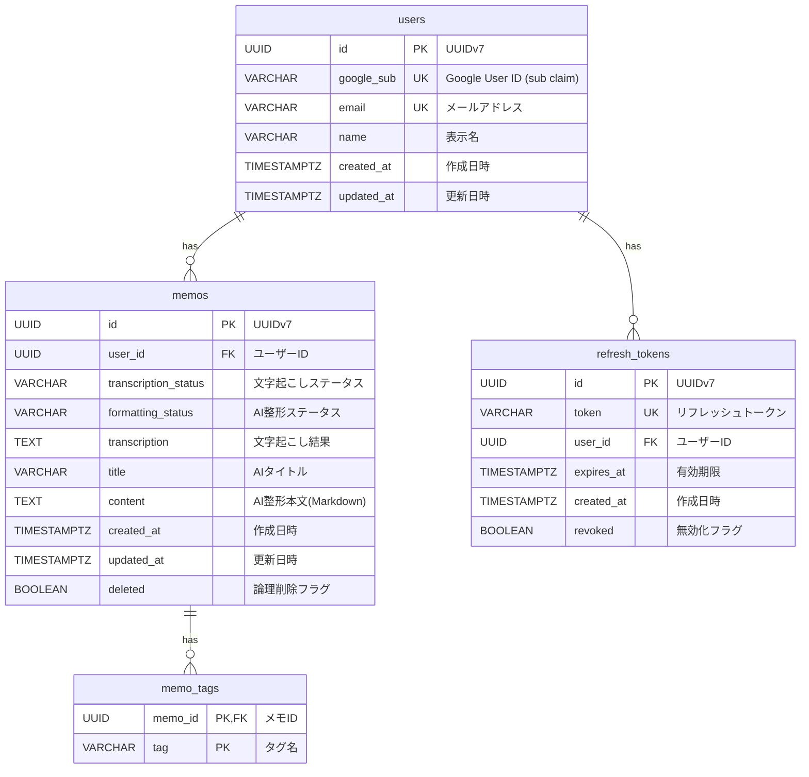

# ER図

## テーブル概要

| テーブル名       | 説明                                                       |
| ---------------- | ---------------------------------------------------------- |
| `users`          | ユーザーアカウント情報（Google OAuth 認証）                |
| `memos`          | AI 整形済みボイスメモ（文字起こし→AI整形の2段階処理）      |
| `memo_tags`      | メモタグ（AI 生成またはユーザー編集）                      |
| `refresh_tokens` | JWT リフレッシュトークン（トークンローテーション対応）     |

## リレーションシップ

- **users → memos**: 1対多（1ユーザーが複数のメモを持つ）
- **users → refresh_tokens**: 1対多（1ユーザーが複数のトークンを持つ）
- **memos → memo_tags**: 1対多（1メモが複数のタグを持つ）

## ステータス値

### transcription_status / formatting_status

| 値           | 説明     |
| ------------ | -------- |
| `PENDING`    | 処理待ち |
| `PROCESSING` | 処理中   |
| `COMPLETED`  | 完了     |
| `FAILED`     | 失敗     |
