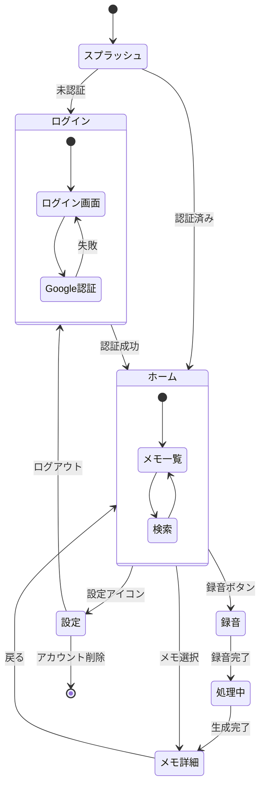
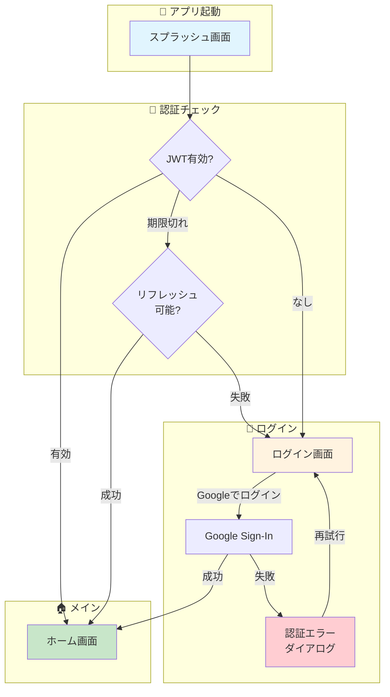
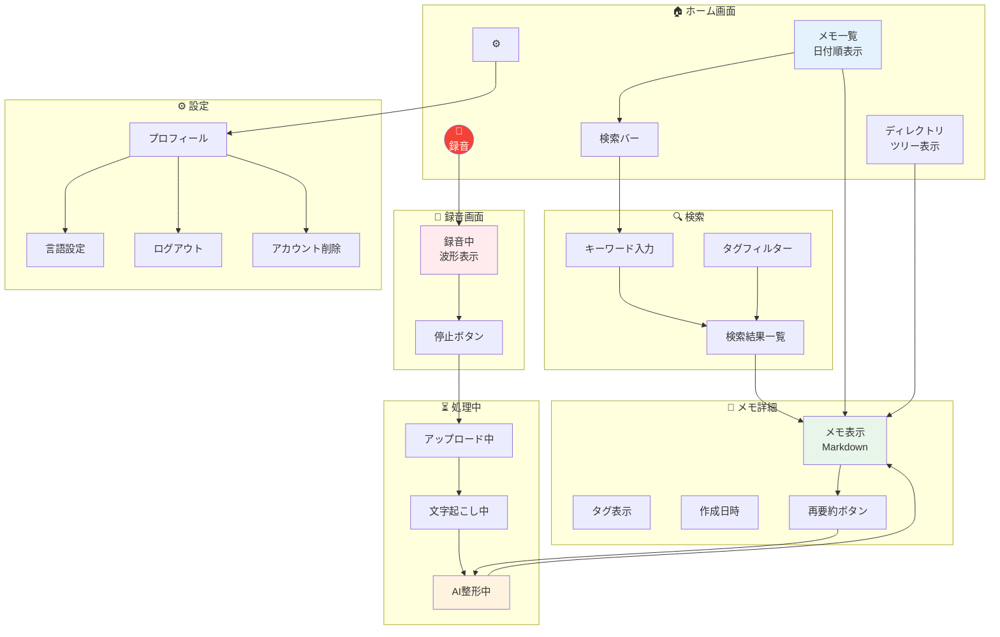
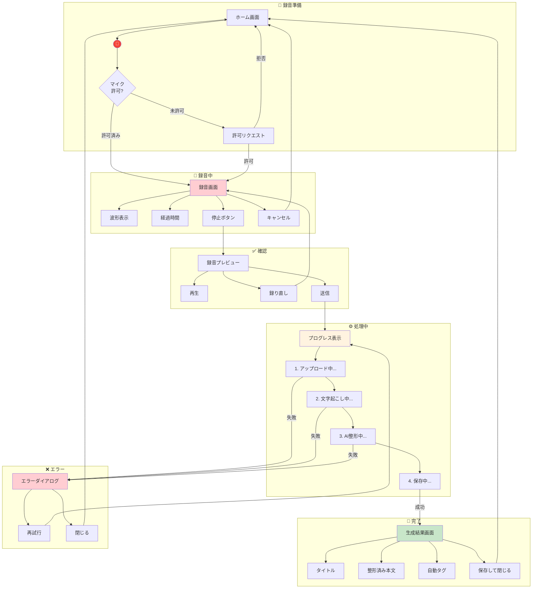
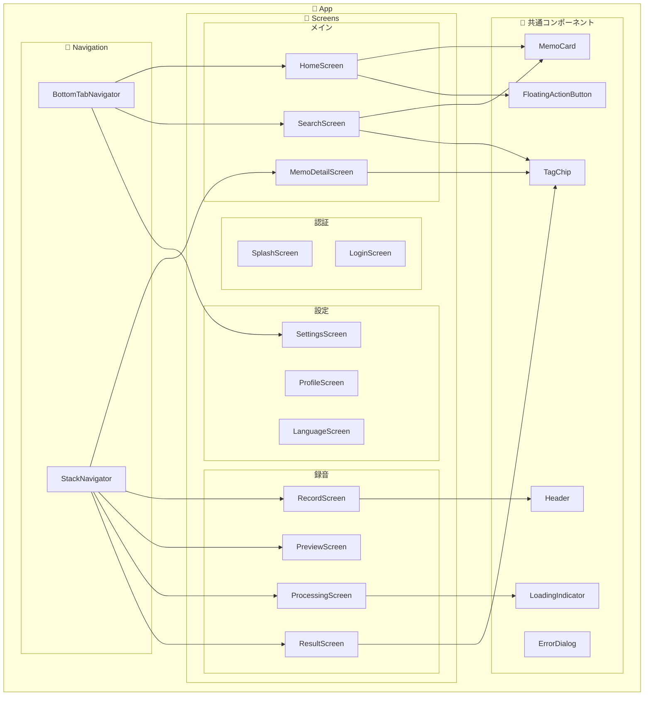

# 画面遷移図

VoiceBookLM モバイルアプリの画面遷移を図示します。

---

## 全体概要



---

## 1. 認証フロー



### 画面詳細

| 画面 | 説明 | 主要アクション |
|-----|------|--------------|
| スプラッシュ | アプリロゴ表示、JWT検証 | 自動遷移 |
| ログイン | Google Sign-In ボタン | Googleでログイン |
| 認証エラー | エラーメッセージ表示 | 再試行、閉じる |

---

## 2. メイン画面フロー



---

## 3. 録音〜保存フロー（詳細）



---

## 4. 画面一覧

### 認証系

| # | 画面名 | パス | 説明 |
|---|-------|-----|------|
| 1 | スプラッシュ | `/splash` | アプリ起動時のロード画面 |
| 2 | ログイン | `/login` | Google Sign-In ボタン |

### メイン系

| # | 画面名 | パス | 説明 |
|---|-------|-----|------|
| 3 | ホーム | `/home` | メモ一覧、ディレクトリ表示 |
| 4 | 検索 | `/search` | キーワード・タグ検索 |
| 5 | メモ詳細 | `/memo/:id` | Markdown形式でメモ表示 |

### 録音系

| # | 画面名 | パス | 説明 |
|---|-------|-----|------|
| 6 | 録音 | `/record` | 音声録音画面 |
| 7 | 録音確認 | `/record/preview` | 録音プレビュー・送信確認 |
| 8 | 処理中 | `/record/processing` | アップロード〜AI整形のプログレス |
| 9 | 生成結果 | `/record/result` | 生成されたメモの確認 |

### 設定系

| # | 画面名 | パス | 説明 |
|---|-------|-----|------|
| 10 | 設定 | `/settings` | 設定メニュー |
| 11 | プロフィール | `/settings/profile` | ユーザー情報表示 |
| 12 | 言語設定 | `/settings/language` | 文字起こし言語選択 |

---

## 5. 画面コンポーネント構成



---

## 6. ナビゲーション構造

```
App
├── AuthStack (未認証時)
│   ├── Splash
│   └── Login
│
└── MainStack (認証済み)
    ├── BottomTabs
    │   ├── HomeTab
    │   │   └── Home
    │   ├── SearchTab
    │   │   └── Search
    │   └── SettingsTab
    │       └── Settings
    │
    └── Modals / Stacks
        ├── MemoDetail
        ├── RecordFlow
        │   ├── Record
        │   ├── Preview
        │   ├── Processing
        │   └── Result
        ├── Profile
        └── Language
```

---

## 7. 状態遷移表

### 認証状態

| 現在の状態 | イベント | 次の状態 | アクション |
|-----------|---------|---------|-----------|
| 未認証 | アプリ起動 | スプラッシュ | JWT確認 |
| スプラッシュ | JWT有効 | ホーム | 自動遷移 |
| スプラッシュ | JWT無効 | ログイン | 自動遷移 |
| ログイン | Google認証成功 | ホーム | トークン保存 |
| ログイン | Google認証失敗 | ログイン | エラー表示 |
| 認証済み | ログアウト | ログイン | トークン削除 |
| 認証済み | アカウント削除 | ログイン | データ削除 |

### 録音状態

| 現在の状態 | イベント | 次の状態 | アクション |
|-----------|---------|---------|-----------|
| ホーム | 録音ボタン | 録音画面 | 権限確認 |
| 録音画面 | 停止 | プレビュー | 録音停止 |
| 録音画面 | キャンセル | ホーム | 録音破棄 |
| プレビュー | 送信 | 処理中 | API呼び出し |
| プレビュー | 録り直し | 録音画面 | 録音リセット |
| 処理中 | 完了 | 結果画面 | レスポンス表示 |
| 処理中 | エラー | エラーダイアログ | エラー表示 |
| 結果画面 | 保存 | ホーム | 一覧更新 |

---

## 8. ワイヤーフレーム概要

### ホーム画面

```
┌─────────────────────────────────┐
│  📱 VoiceBookLM          ⚙️    │
├─────────────────────────────────┤
│  🔍 メモを検索...               │
├─────────────────────────────────┤
│                                 │
│  📁 アイデア                    │
│    └─ 📄 新機能のアイデア       │
│    └─ 📄 改善案メモ             │
│                                 │
│  📁 日記                        │
│    └─ 📄 今日の振り返り         │
│                                 │
│  📁 仕事                        │
│    └─ 📄 会議メモ               │
│                                 │
│                                 │
│                        ┌─────┐  │
│                        │ 🎤  │  │
│                        └─────┘  │
├─────────────────────────────────┤
│   🏠      🔍      ⚙️           │
└─────────────────────────────────┘
```

### 録音画面

```
┌─────────────────────────────────┐
│  ← 録音                         │
├─────────────────────────────────┤
│                                 │
│                                 │
│         ╭──────────────╮        │
│         │              │        │
│         │   🔴 録音中   │        │
│         │              │        │
│         ╰──────────────╯        │
│                                 │
│     ∿∿∿∿∿∿∿∿∿∿∿∿∿∿∿∿∿         │
│     波形表示                    │
│                                 │
│           00:15                 │
│                                 │
│         ┌─────────┐             │
│         │  停止   │             │
│         └─────────┘             │
│                                 │
│     キャンセル                   │
│                                 │
└─────────────────────────────────┘
```

### メモ詳細画面

```
┌─────────────────────────────────┐
│  ←  メモ詳細              ⋮    │
├─────────────────────────────────┤
│                                 │
│  # 新機能のアイデア             │
│                                 │
│  📅 2025-12-17                  │
│  🏷️ アイデア  機能  MVP         │
│                                 │
│  ─────────────────────────────  │
│                                 │
│  ## 概要                        │
│  音声入力でメモを取れる         │
│  アプリを作りたい。             │
│                                 │
│  ## ポイント                    │
│  - AIで自動整形                 │
│  - タグ自動付与                 │
│  - Markdown形式                 │
│                                 │
│  ## 次のアクション              │
│  - 技術選定を進める             │
│                                 │
│         ┌─────────┐             │
│         │ 再要約  │             │
│         └─────────┘             │
└─────────────────────────────────┘
```

---

## 関連ドキュメント

- [PRD](../概要・設計/PRD.md) - 製品要件定義
- [アクティビティ図](./activity.md) - ユーザー操作フロー
- [シーケンス図](./sequence.md) - システム間の通信フロー
- [API リファレンス](../バックエンド/api-reference.md) - バックエンドAPI仕様
