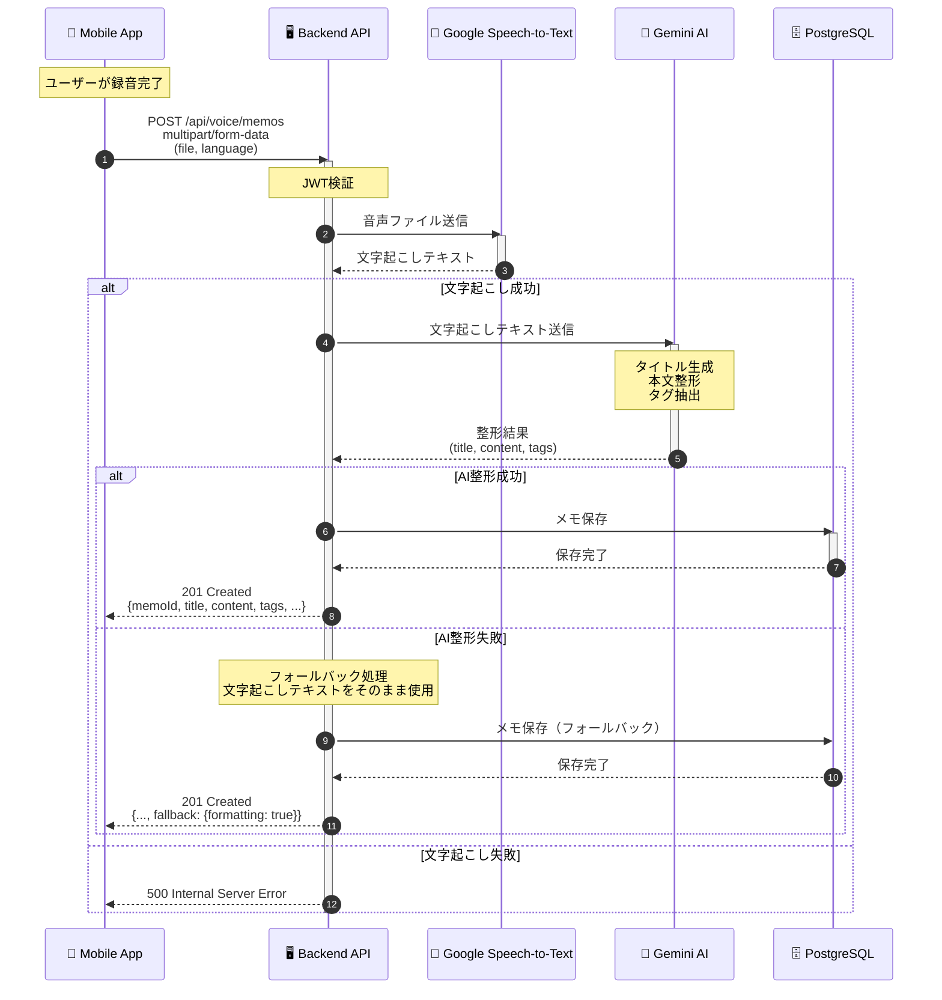
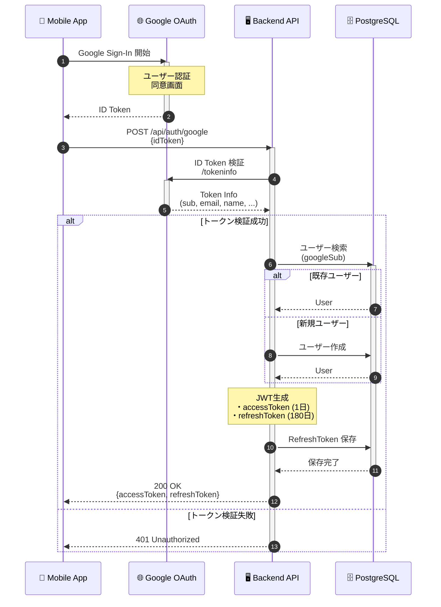
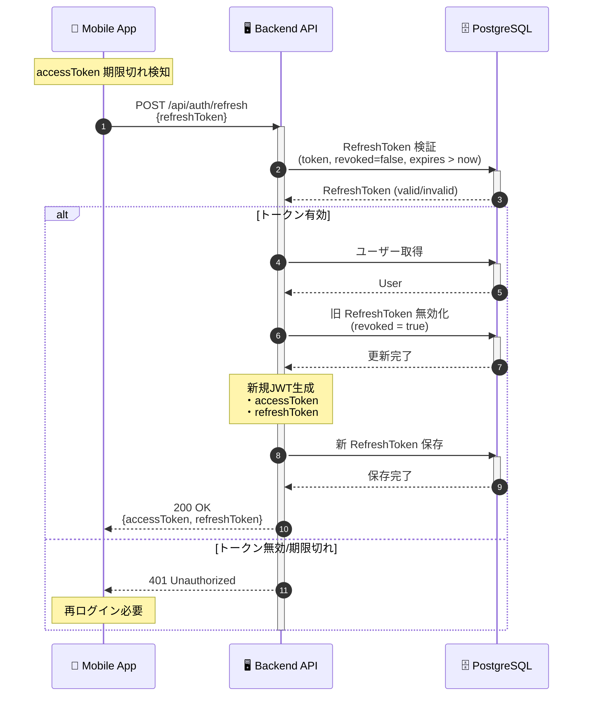
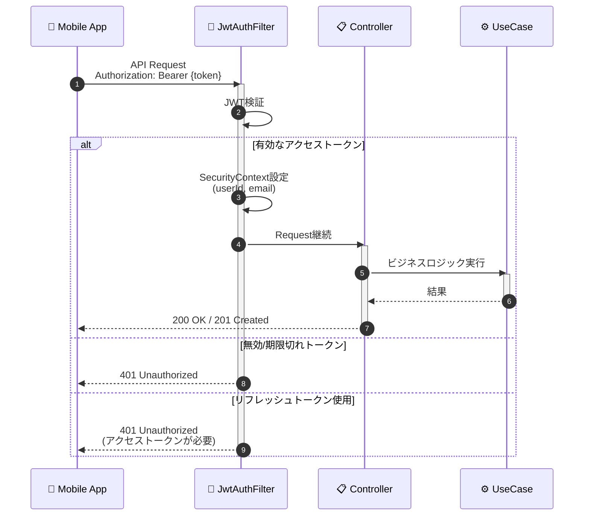
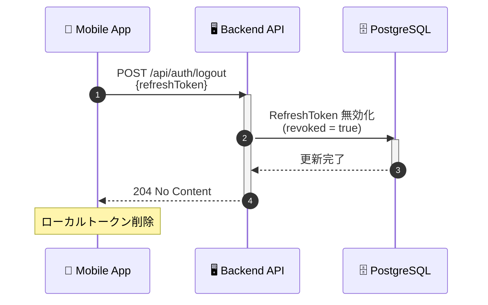
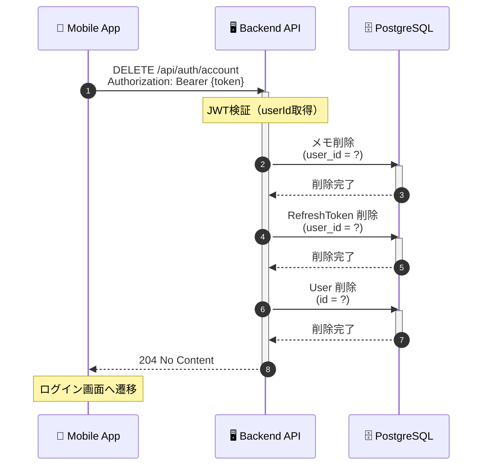
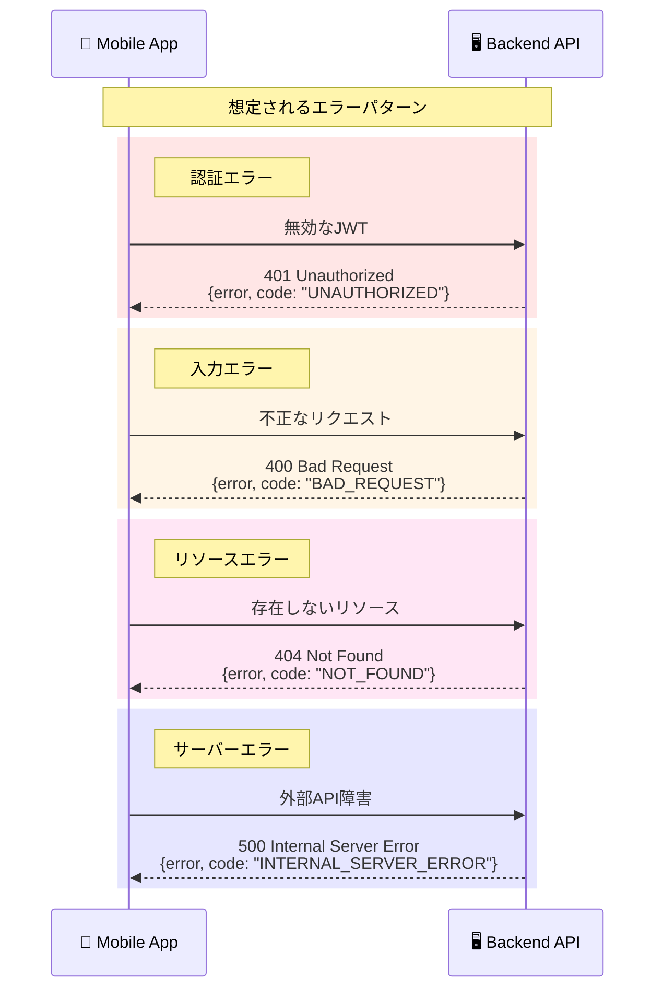

# シーケンス図

システムの主要なフローを時系列で図示したシーケンス図です。

---

## 1. 音声メモ生成フロー（メインフロー）

アプリのコア機能「音声 → 文字起こし → AI整形 → 保存」の全体フローです。



### フローの詳細

| ステップ | 処理内容 | 処理時間目安 |
|---------|---------|------------|
| 1 | 音声ファイルアップロード | ファイルサイズ依存 |
| 2-3 | JWT認証 + 文字起こし | 2-10秒 |
| 4-5 | AI整形処理 | 1-3秒 |
| 6-7 | DB保存 | 100ms以下 |

### エラーハンドリング

- **文字起こし失敗**: 500エラーを返却
- **AI整形失敗**: フォールバックモードで文字起こしテキストをそのまま保存
- **DB保存失敗**: 500エラーを返却

---

## 2. Google OAuth ログインフロー

Google Sign-In を使用した認証フローです。



### セキュリティポイント

| 項目 | 内容 |
|-----|------|
| ID Token 検証 | Google の `/tokeninfo` エンドポイントで検証 |
| aud クレーム確認 | クライアントIDとの一致を確認 |
| メール検証確認 | `email_verified: true` を確認 |
| UUIDv7 使用 | 時系列順でソート可能なID |

---

## 3. トークンリフレッシュフロー

アクセストークン更新時のトークンローテーションフローです。



### トークンローテーションの意義

```
旧トークン使用 → 無効化 → 新トークン発行
```

- **リプレイ攻撃防止**: 古いトークンは使えなくなる
- **トークン漏洩検知**: 無効化済みトークンの使用で検知可能
- **セッション管理**: アクティブなセッションのみ有効

---

## 4. 認証付きAPI呼び出しフロー

JWT認証が必要なAPIの共通フローです。



---

## 5. ログアウトフロー



---

## 6. アカウント削除フロー



### 削除順序の重要性

外部キー制約を考慮し、以下の順序で削除:

1. **VoiceMemo** (user_id 参照)
2. **RefreshToken** (user_id 参照)
3. **User** (親テーブル)

---

## 7. エラーハンドリング全体像



---

## 処理時間の目安

| フロー | 想定処理時間 | ボトルネック |
|-------|------------|------------|
| ログイン | 500ms - 1s | Google Token検証 |
| トークンリフレッシュ | 100ms - 200ms | DB操作 |
| 音声メモ生成 | 3s - 15s | Speech-to-Text + AI整形 |
| ログアウト | 50ms - 100ms | DB操作 |
| アカウント削除 | 200ms - 500ms | 複数テーブル削除 |

---

## 関連ドキュメント

- [アーキテクチャ](../概要・設計/architecture.md) - システム全体構成
- [認証](../バックエンド/auth.md) - 認証システム詳細
- [API リファレンス](../バックエンド/api-reference.md) - API仕様詳細
- [アクティビティ図](./activity.md) - ユーザー操作フロー
