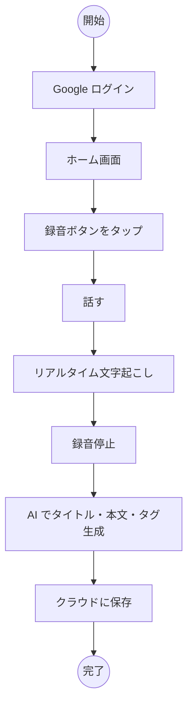
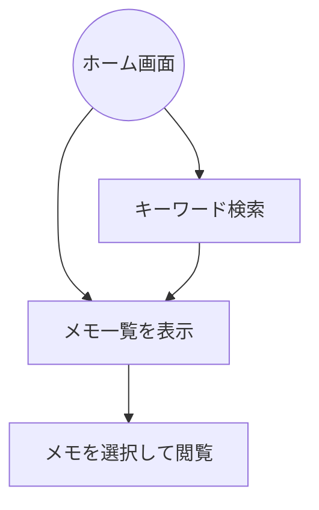

# ボイスメモ アクティビティ図

## メインフロー（録音〜保存）

## メモ閲覧フロー

## フローの説明

### 録音フロー
1. **Google ログイン** → JWT トークン取得
2. **録音ボタンをタップ** → WebSocket 接続確立
3. **話す** → 音声をリアルタイムでサーバーに送信
4. **リアルタイム文字起こし** → 話しながらテキスト表示
5. **録音停止** → 最終文字起こし確定
6. **AI 処理** → タイトル・本文・タグを自動生成
7. **クラウドに保存** → AI 整形済みメモのみ永続化

### メモ閲覧フロー
- **一覧表示**: 日付ソートでメモを表示
- **検索**: キーワードやタグで絞り込み
- **閲覧**: メモを選択して内容を確認
