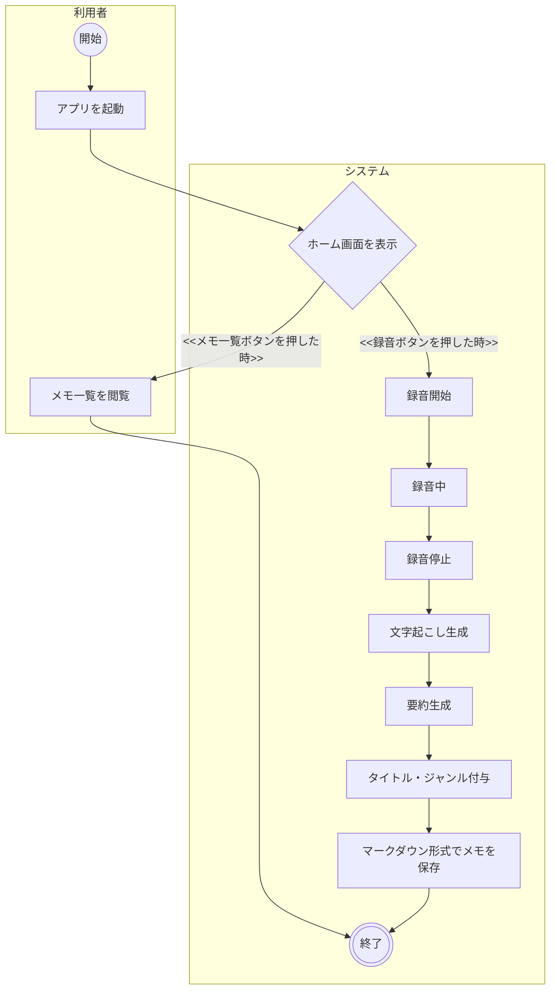

```mermaid
%% グラフの方向を上から下へ指定
flowchart TD

    %% スイムレーン：利用者
    subgraph User [利用者]
        direction TB
        Start((開始))
        Launch[アプリを起動]
        MemoView[メモ一覧を閲覧]
    end

    %% スイムレーン：システム
    subgraph System [システム]
        direction TB
        
        %% 条件分岐（ひし形）
        Branch{ホーム画面を表示}
        
        RecStart[録音開始]
        RecIng[録音中]
        RecStop[録音停止]
        Transcribe[文字起こし生成]
        Summarize[要約生成]
        AddTitle[タイトル・ジャンル付与]
        SaveMarkdown[マークダウン形式でメモを保存]
        
        End(((終了)))
    end

    %% 処理の流れ（フロー）の定義
    
    %% 開始 -> アプリ起動 -> ホーム画面表示
    Start --> Launch
    Launch --> Branch

    %% 分岐処理
    %% ケース1：メモ一覧ボタンを押した時（利用者側へ遷移）
    Branch -- "<<メモ一覧ボタンを押した時>>" --> MemoView
    
    %% ケース2：録音ボタンを押した時（システム側で処理継続）
    Branch -- "<<録音ボタンを押した時>>" --> RecStart

    %% 録音フロー
    RecStart --> RecIng
    RecIng --> RecStop
    RecStop --> Transcribe
    Transcribe --> Summarize
    Summarize --> AddTitle
    AddTitle --> SaveMarkdown

    %% 終了処理への合流
    MemoView --> End
    SaveMarkdown --> End
```
