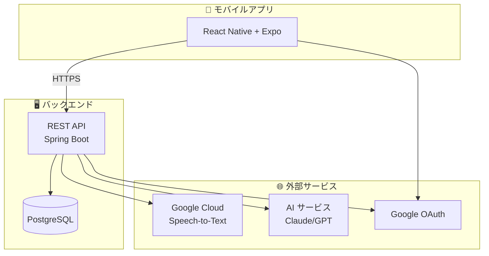
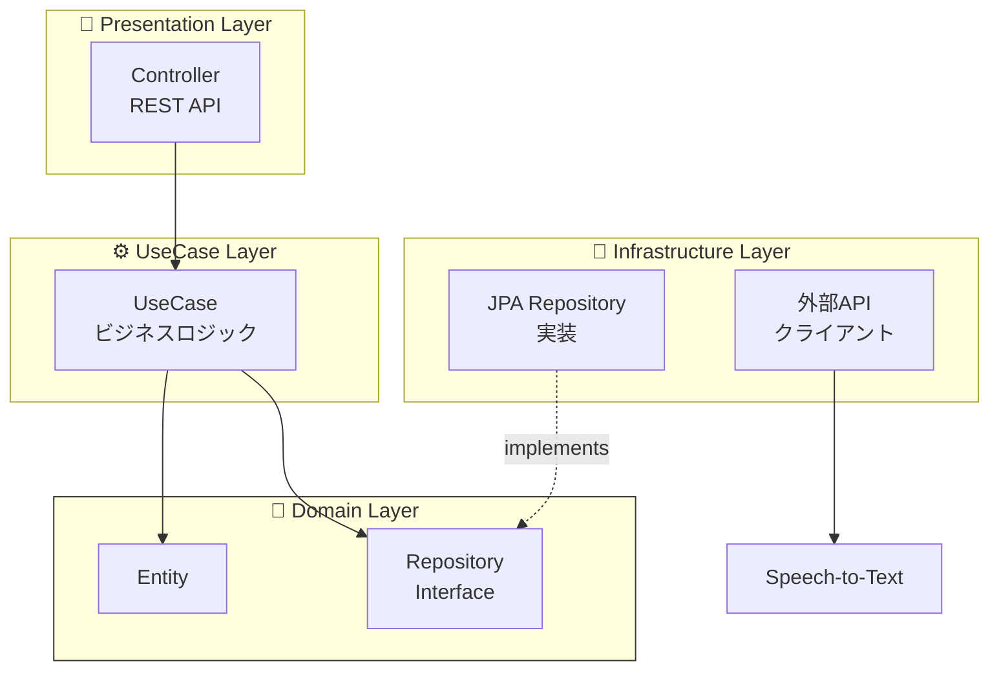

# アーキテクチャ

## システム全体像



## オニオンアーキテクチャ × DDD

バックエンドは**オニオンアーキテクチャ**と**ドメイン駆動設計(DDD)**を採用しています。



### レイヤー責務

| レイヤー | 責務 | 依存 |
|---------|------|------|
| **Domain** | エンティティ・ビジネスルール | なし（純粋Kotlin） |
| **UseCase** | アプリケーション固有ロジック | Domain のみ |
| **Presentation** | REST API・DTO変換 | UseCase のみ |
| **Infrastructure** | DB実装・外部API | Domain IF を実装 |

## ディレクトリ構成

### Backend

```
voicebooklm-backend/src/main/kotlin/com/assari/voicebooklm/
├── domain/              # ドメイン層 (ピュア Kotlin)
│   ├── model/           # エンティティ・値オブジェクト
│   ├── repository/      # リポジトリインターフェース
│   └── service/         # ドメインサービス
├── usecase/             # ユースケース層
├── infrastructure/      # インフラストラクチャ層
│   ├── jpa/             # JPA実装・Entity・Mapper
│   ├── api/             # 外部APIクライアント
│   └── config/          # Spring設定
└── presentation/        # プレゼンテーション層
    └── controller/      # RESTコントローラー
```

### Frontend

```
voicebooklm-frontend/
├── app/                 # Expo Router ページ
├── components/          # UIコンポーネント
├── hooks/               # カスタムHooks
├── services/            # API通信
└── assets/              # 画像・フォント
```

## 技術スタック

### Backend
| カテゴリ | 技術 |
|---------|------|
| 言語 | Kotlin 2.0.21 |
| フレームワーク | Spring Boot 3.4.12 |
| ランタイム | JDK 21 LTS |
| データベース | PostgreSQL 16 |
| 全文検索 | pg_bigm 拡張 |

### Frontend
| カテゴリ | 技術 |
|---------|------|
| 言語 | TypeScript 5.9 |
| フレームワーク | React Native 0.81 + Expo ~54 |
| ルーティング | Expo Router 6 |
| 音声録音 | expo-audio |
