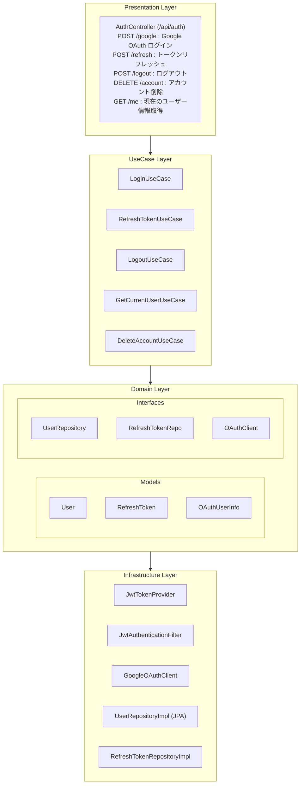
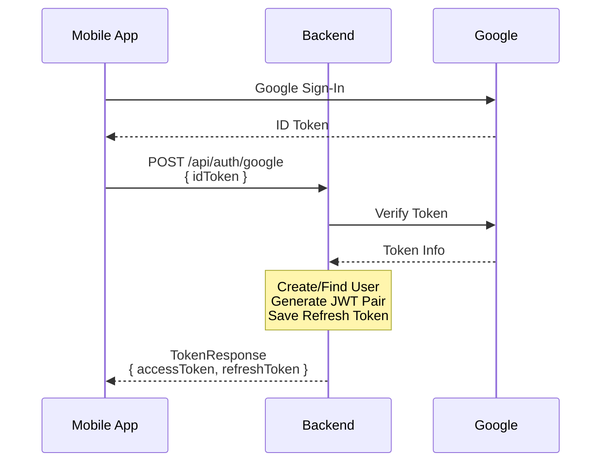
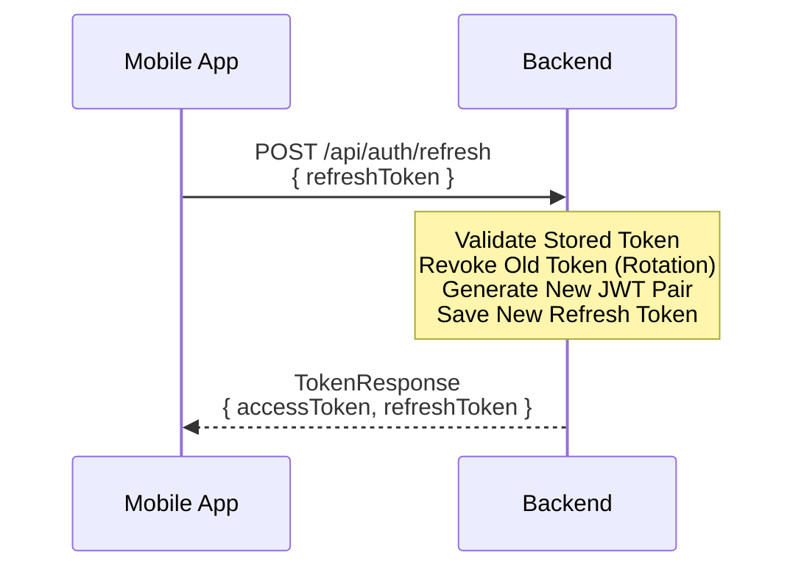

# 認証

VoiceBookLM Backend の認証システムは、Google OAuth 認証と JWT トークン管理を提供するクリーンアーキテクチャベースの実装です。

## アーキテクチャ概要



---

## Domain Layer

### User

**ファイル:** `src/main/kotlin/com/assari/voicebooklm/domain/model/User.kt`

Google OAuth 認証で取得したユーザー情報を表現するドメインモデル。

```kotlin
class User(
    val id: UUID,           // UUIDv7 (時系列順)
    val googleSub: String,  // Google の一意識別子
    val email: String,      // メールアドレス
    var name: String,       // 表示名
    val createdAt: Instant,
    var updatedAt: Instant
)
```

**メソッド:**
| メソッド | 説明 |
|---------|------|
| `updateName(newName: String)` | ユーザー名を更新し、`updatedAt` を現在時刻に設定 |

---

### RefreshToken

**ファイル:** `src/main/kotlin/com/assari/voicebooklm/domain/model/RefreshToken.kt`

JWT リフレッシュトークンの情報を表現するドメインモデル。トークンローテーションをサポート。

```kotlin
class RefreshToken(
    val id: UUID,           // UUIDv7
    val token: String,      // JWT トークン文字列
    val userId: UUID,       // 所有ユーザーの ID
    val expiresAt: Instant, // 有効期限
    val createdAt: Instant,
    var revoked: Boolean    // 無効化フラグ
)
```

**メソッド:**
| メソッド | 戻り値 | 説明 |
|---------|--------|------|
| `isExpired()` | `Boolean` | 有効期限切れかどうか |
| `isValid()` | `Boolean` | 有効かどうか（未失効 かつ 期限内） |
| `revoke()` | `Unit` | トークンを無効化 |

---

### OAuthUserInfo

**ファイル:** `src/main/kotlin/com/assari/voicebooklm/domain/model/OAuthUserInfo.kt`

OAuth プロバイダーから取得したユーザー情報を表現する値オブジェクト。

```kotlin
data class OAuthUserInfo(
    val providerId: String,  // プロバイダー固有 ID (Google: sub)
    val email: String,
    val name: String,
    val picture: String?     // プロフィール画像 URL
)
```

---

### OAuthClient (Interface)

**ファイル:** `src/main/kotlin/com/assari/voicebooklm/domain/gateway/OAuthClient.kt`

OAuth 認証プロバイダーとの通信を抽象化するゲートウェイインターフェース。

```kotlin
interface OAuthClient {
    fun verifyIdTokenAndGetUserInfo(idToken: String): OAuthUserInfo?
}
```

**実装:**

- `GoogleOAuthClient` - Google OAuth 認証

---

### UserRepository (Interface)

**ファイル:** `src/main/kotlin/com/assari/voicebooklm/domain/repository/UserRepository.kt`

```kotlin
interface UserRepository {
    fun save(user: User): User
    fun findById(id: UUID): User?
    fun findByEmail(email: String): User?
    fun findByGoogleSub(googleSub: String): User?
    fun deleteById(id: UUID)
}
```

---

### RefreshTokenRepository (Interface)

**ファイル:** `src/main/kotlin/com/assari/voicebooklm/domain/repository/RefreshTokenRepository.kt`

```kotlin
interface RefreshTokenRepository {
    fun save(token: RefreshToken): RefreshToken
    fun findByTokenAndValid(token: String, now: Instant): RefreshToken?
    fun revokeByToken(token: String)
    fun revokeByUserId(userId: UUID)    // ログアウト時
    fun deleteByUserId(userId: UUID)    // アカウント削除時
}
```

---

## UseCase Layer

### LoginUseCase

**ファイル:** `src/main/kotlin/com/assari/voicebooklm/usecase/auth/LoginUseCase.kt`

OAuth 認証フローを処理し、JWT トークンペアを発行する。

**入力:** `LoginCommand(idToken: String)`

**出力:** `LoginResult(accessToken, refreshToken, userId)`

**フロー:**

1. `OAuthClient` で ID トークンを検証
2. ユーザーを取得または新規作成
3. アクセストークン・リフレッシュトークンを生成
4. リフレッシュトークンを DB に保存

**例外:**

- `InvalidIdTokenException` - ID トークンの検証失敗

---

### RefreshTokenUseCase

**ファイル:** `src/main/kotlin/com/assari/voicebooklm/usecase/auth/RefreshTokenUseCase.kt`

リフレッシュトークンローテーションを実装。旧トークンを無効化し、新しいトークンペアを発行。

**入力:** `RefreshTokenCommand(refreshToken: String)`

**出力:** `RefreshTokenResult(accessToken, refreshToken, userId)`

**フロー:**

1. 保存済みリフレッシュトークンを検証
2. ユーザーを取得
3. **旧トークンを無効化**（ローテーション）
4. 新しいトークンペアを生成・保存

**例外:**

- `InvalidRefreshTokenException` - トークンが無効または期限切れ

---

### LogoutUseCase

**ファイル:** `src/main/kotlin/com/assari/voicebooklm/usecase/auth/LogoutUseCase.kt`

リフレッシュトークンを無効化してログアウト。

**入力:** `LogoutCommand(refreshToken: String)`

**出力:** なし

---

### GetCurrentUserUseCase

**ファイル:** `src/main/kotlin/com/assari/voicebooklm/usecase/auth/GetCurrentUserUseCase.kt`

JWT から取得したユーザー ID でユーザー情報を取得。

**入力:** `GetCurrentUserCommand(userId: UUID)`

**出力:** `UserInfo(id, email, name)`

---

### DeleteAccountUseCase

**ファイル:** `src/main/kotlin/com/assari/voicebooklm/usecase/auth/DeleteAccountUseCase.kt`

ユーザーのすべてのデータを物理削除。

**入力:** `DeleteAccountCommand(userId: UUID)`

**削除順序（参照整合性維持）:**

1. メモ
2. リフレッシュトークン
3. ユーザー

---

## Infrastructure Layer

### JwtTokenProvider

**ファイル:** `src/main/kotlin/com/assari/voicebooklm/infrastructure/security/JwtTokenProvider.kt`

JWT アクセストークン・リフレッシュトークンの生成・検証を行う。HS256 アルゴリズムを使用。

**設定:**
| プロパティ | 説明 |
|-----------|------|
| `jwt.secret` | 署名用シークレットキー |
| `jwt.access-token-expiration` | アクセストークン有効期限（ms） |
| `jwt.refresh-token-expiration` | リフレッシュトークン有効期限（ms） |

**メソッド:**
| メソッド | 説明 |
|---------|------|
| `generateAccessToken(userId, email)` | アクセストークン生成 |
| `generateRefreshToken(userId)` | リフレッシュトークン生成 |
| `validateToken(token)` | トークン検証 |
| `isAccessToken(token)` | アクセストークン判定 |
| `isRefreshToken(token)` | リフレッシュトークン判定 |
| `getUserIdFromToken(token)` | トークンからユーザー ID 抽出 |
| `getEmailFromToken(token)` | トークンからメール抽出 |

**トークンクレーム:**

- `userId` - ユーザー ID
- `email` - メールアドレス（アクセストークンのみ）
- `tokenType` - `access` または `refresh`

---

### JwtAuthenticationFilter

**ファイル:** `src/main/kotlin/com/assari/voicebooklm/infrastructure/security/JwtAuthenticationFilter.kt`

Authorization ヘッダーから JWT トークンを抽出し、検証する Spring Security フィルタ。

**動作:**

1. `Authorization: Bearer <token>` ヘッダーからトークン抽出
2. `JwtTokenProvider` でトークン検証
3. アクセストークンの場合のみ認証情報を `SecurityContext` に設定

---

### GoogleOAuthClient

**ファイル:** `src/main/kotlin/com/assari/voicebooklm/infrastructure/api/GoogleOAuthClient.kt`

`OAuthClient` インターフェースの Google 実装。Google ID トークンの検証とユーザー情報の取得を行う。

**検証フロー:**

1. `https://oauth2.googleapis.com/tokeninfo` エンドポイントで検証
2. `aud` クレームがクライアント ID と一致するか確認
3. メール検証済みか確認
4. `OAuthUserInfo` に変換して返却

---

## Presentation Layer

### AuthController

**ファイル:** `src/main/kotlin/com/assari/voicebooklm/presentation/controller/auth/AuthController.kt`

**Base Path:** `/api/auth`

| メソッド | パス       | 説明                   | 認証 |
| -------- | ---------- | ---------------------- | ---- |
| POST     | `/google`  | Google OAuth ログイン  | 不要 |
| POST     | `/refresh` | トークンリフレッシュ   | 不要 |
| POST     | `/logout`  | ログアウト             | 不要 |
| DELETE   | `/account` | アカウント削除         | 必要 |
| GET      | `/me`      | 現在のユーザー情報取得 | 必要 |

---

### リクエスト/レスポンス

#### GoogleAuthRequest

```json
{
  "idToken": "eyJhbGciOiJSUzI1NiIsInR..."
}
```

#### RefreshTokenRequest / LogoutRequest

```json
{
  "refreshToken": "eyJhbGciOiJIUzI1NiIsInR..."
}
```

#### TokenResponse

```json
{
  "accessToken": "eyJhbGciOiJIUzI1NiIsInR...",
  "refreshToken": "eyJhbGciOiJIUzI1NiIsInR..."
}
```

#### UserResponse

```json
{
  "id": "01916f54-1234-7abc-def0-123456789abc",
  "email": "user@example.com",
  "name": "田中太郎"
}
```

#### ErrorResponse

```json
{
  "error": "認証に失敗しました",
  "code": "UNAUTHORIZED"
}
```

---

## 認証フロー

### 1. ログインフロー



### 2. トークンリフレッシュフロー



---

## セキュリティ考慮事項

1. **トークンローテーション**: リフレッシュトークン使用時に旧トークンを無効化
2. **JWT 署名検証**: HS256 アルゴリズムによる改ざん検知
3. **トークンタイプ分離**: アクセストークンとリフレッシュトークンを区別
4. **メール検証**: Google 認証時にメール検証済みを確認
5. **クライアント ID 検証**: ID トークンの `aud` クレームを検証
