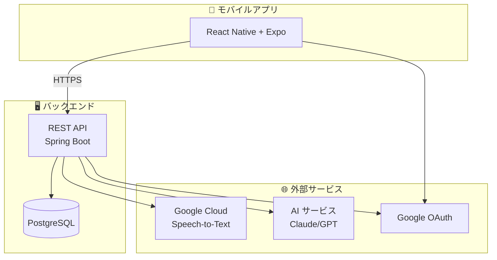
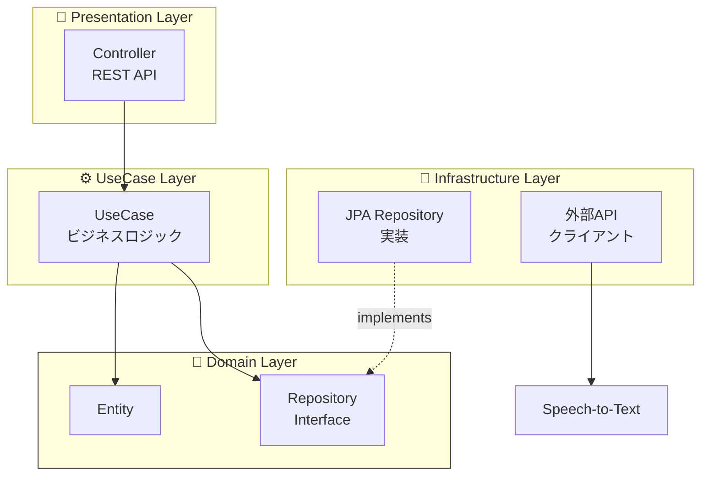

# アーキテクチャ

## システム全体像

## backend オニオンアーキテクチャ × DDD

バックエンドは**オニオンアーキテクチャ**と**ドメイン駆動設計(DDD)**を採用しています。

### レイヤー責務

| レイヤー           | 責務                         | 依存               |
| ------------------ | ---------------------------- | ------------------ |
| **Domain**         | エンティティ・ビジネスルール | なし（純粋Kotlin） |
| **UseCase**        | アプリケーション固有ロジック | Domain のみ        |
| **Presentation**   | REST API・DTO変換            | UseCase のみ       |
| **Infrastructure** | DB実装・外部API              | Domain IF を実装   |

## 技術スタック

### Backend

| カテゴリ       | 技術               |
| -------------- | ------------------ |
| 言語           | Kotlin 2.0.21      |
| フレームワーク | Spring Boot 3.4.12 |
| ランタイム     | JDK 21 LTS         |
| データベース   | PostgreSQL 16      |
