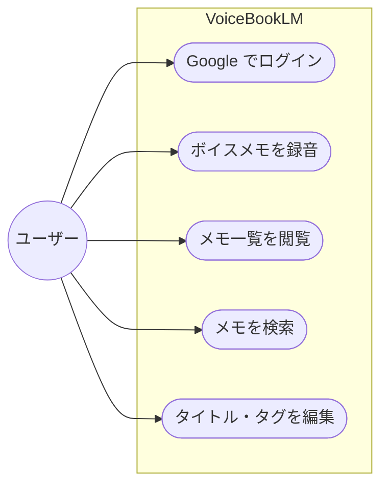

# ボイスメモ ユースケース図

## ユースケース一覧

### MVP 機能（実装対象）

| ユースケース             | 説明                                           | アクター |
| ------------------------ | ---------------------------------------------- | -------- |
| Google でログインする    | Google OAuth で認証し、JWT トークンを取得      | ユーザー |
| ボイスメモを録音する     | ワンタップで録音開始・停止                     | ユーザー |
| 音声をサーバーに送信する | 録音完了後に REST API 経由で音声ファイルを送信 | システム |
| 文字起こしする           | 録音完了後に ASR で一括テキスト化              | システム |
| AI でメモを整理する      | タイトル・本文・タグを自動生成                 | システム |
| クラウドに保存する       | AI 整形済みメモのみを永続化                    | システム |
| メモ一覧を閲覧する       | 日付ソートでメモを表示                         | ユーザー |
| メモを検索する           | 全文検索でメモを検索                           | ユーザー |
| タグでフィルタする       | タグ指定でメモを絞り込み                       | ユーザー |
| タイトル・タグを編集する | AI 生成結果を手動で修正                        | ユーザー |

### MVP 対象外

| ユースケース               | 理由                                     |
| -------------------------- | ---------------------------------------- |
| 音声を永続保存する         | プライバシー重視設計により永久に含まない |
| 要約を生成する             | MVP スコープ外                           |
| 複数発話者を判定する       | 個人メモ特化のため対象外                 |
| Apple/メールでログインする | MVP では Google 認証のみ                 |
| オフラインで録音する       | MVP では対象外                           |

## データポリシー

| データ種別          | 永続保存 | 説明                      |
| ------------------- | -------- | ------------------------- |
| AI 整形済みメモ本文 | ✓        | メモの主内容として保存    |
| タイトル            | ✓        | AI 生成または編集結果     |
| タグ                | ✓        | AI 生成または編集結果     |
| タイムスタンプ      | ✓        | 録音開始/終了の情報       |
| 音声データ          | ✗        | 処理完了後に削除          |
| 生文字起こし        | ✗        | AI 整形前の生データは破棄 |
