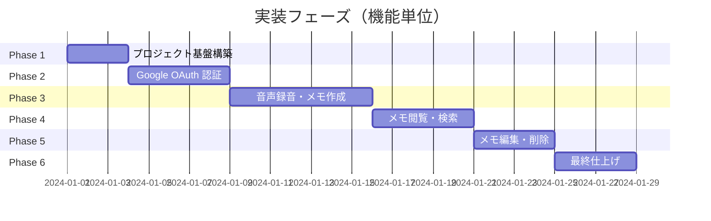
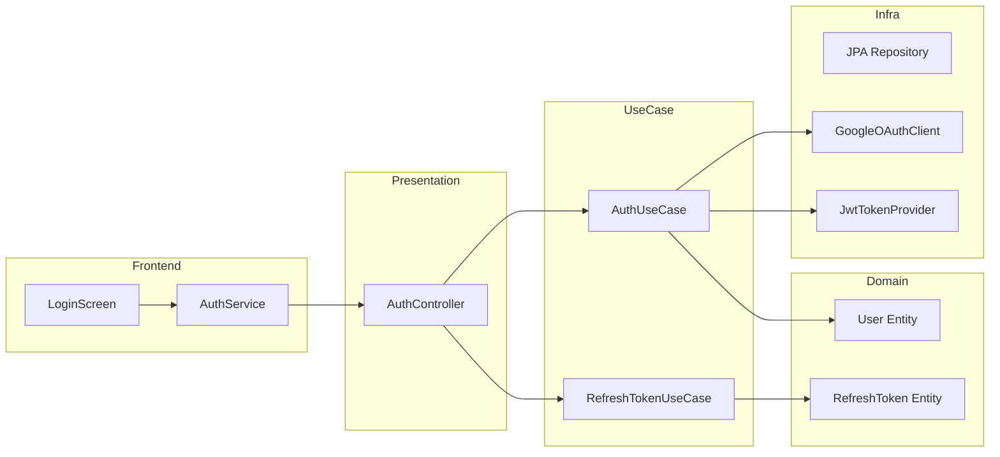
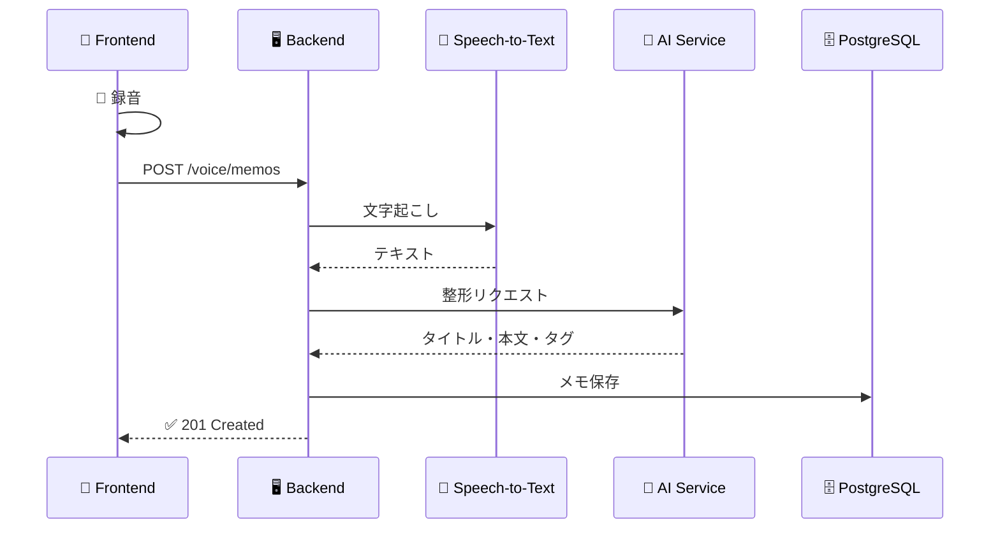
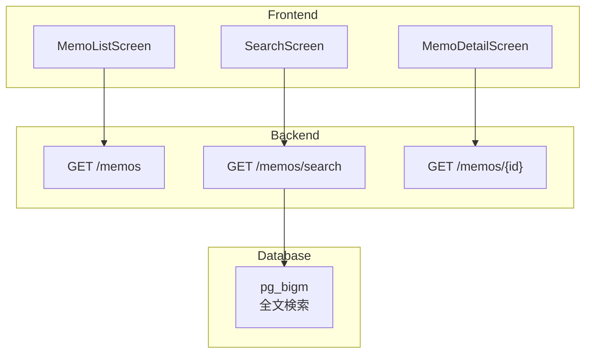
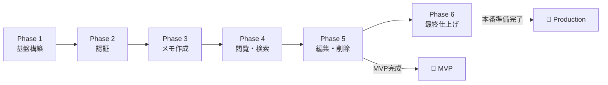

# 実装タスク

## 概要

本実装タスクは、**機能単位**で縦断的に実装できるよう整理されています。  
各機能は Domain → UseCase → Infrastructure → Presentation → Frontend → Test の順に実装し、1つの機能が完成した時点で動作確認が可能です。

---

## フェーズ概要

---

## Phase 1: プロジェクト基盤構築

> 完了後: Backend/Frontend の開発環境が整い、DB スキーマが準備完了

### Backend
- [ ] Gradle 依存関係追加（google-cloud-speech, jjwt, uuid-creator）
- [ ] application.yml 設定（JWT, PostgreSQL, Google Cloud, CORS）

### Frontend
- [ ] package.json 依存関係追加（expo-audio, expo-secure-store, axios）
- [ ] マイク権限設定（app.json）

### Database
- [ ] pg_bigm 拡張有効化
- [ ] テーブル作成（users, memos, memo_tags, refresh_tokens）
- [ ] インデックス作成（GIN インデックス、複合インデックス）

---

## Phase 2: Google OAuth 認証

> 完了後: Google ログイン → JWT トークン発行 → 自動リフレッシュ → ログアウトが動作

| レイヤー | 実装内容 |
|----------|----------|
| **Domain** | User, RefreshToken エンティティ、Repository IF |
| **Infrastructure** | JPA Entity, GoogleOAuthClient, JwtTokenProvider |
| **UseCase** | AuthUseCase, RefreshTokenUseCase, LogoutUseCase |
| **Presentation** | /auth/google, /auth/refresh, /auth/logout |
| **Security** | SecurityConfig (JWT フィルタ, CORS) |
| **Frontend** | AuthService, LoginScreen, 起動時自動ログイン |
| **Test** | AuthUseCase, JwtProvider, 統合テスト |

---

## Phase 3: 音声録音・文字起こし・メモ作成

> 完了後: 音声録音 → アップロード → 文字起こし → AI整形 → メモ保存が動作

| レイヤー | 実装内容 |
|----------|----------|
| **Domain** | Memo エンティティ (changeTitle, markAsDeleted) |
| **Infrastructure** | MemoEntity, GoogleSpeechClient, AIFormattingClient |
| **UseCase** | CreateMemoUseCase |
| **Presentation** | POST /voice/memos |
| **Frontend** | AudioRecordingService, VoiceUploadService, RecordingScreen |
| **Test** | CreateMemoUseCase, 統合テスト, 30秒以内確認 |

---

## Phase 4: メモ閲覧・検索

> 完了後: メモ一覧表示、全文検索、タグフィルタ、詳細表示が動作

| レイヤー | 実装内容 |
|----------|----------|
| **Infrastructure** | pg_bigm 全文検索クエリ、ページネーション |
| **UseCase** | SearchMemoUseCase |
| **Presentation** | GET /memos, GET /memos/search, GET /memos/{id} |
| **Frontend** | MemoService, MemoListScreen, MemoDetailScreen, SearchScreen |
| **Test** | SearchMemoUseCase, 0.5秒以内確認 |

---

## Phase 5: メモ編集・削除

> 完了後: メモ編集・削除が動作、**MVP 全機能完成**

| レイヤー | 実装内容 |
|----------|----------|
| **UseCase** | UpdateMemoUseCase, DeleteMemoUseCase |
| **Presentation** | PUT /memos/{id}, DELETE /memos/{id} |
| **Frontend** | 編集モード UI, 削除確認ダイアログ |
| **Test** | UpdateMemoUseCase, DeleteMemoUseCase |

---

## Phase 6: 最終仕上げ

> 完了後: 本番デプロイ準備完了

| カテゴリ | 実装内容 |
|----------|----------|
| **Security** | PostgreSQL TLS 接続, RDS ストレージ暗号化 |
| **Monitoring** | Actuator ヘルスチェック, Logback 設定 |
| **i18n** | ロケール ja_JP, タイムゾーン Asia/Tokyo |
| **Docs** | OpenAPI (Swagger UI), Backend/Frontend README |
| **Test** | カバレッジ 70%+, パフォーマンステスト |

---

## Phase 完成チェックリスト

- [ ] **Phase 1**: Backend/Frontend セットアップ完了
- [ ] **Phase 2**: ログイン・ログアウトが動作
- [ ] **Phase 3**: 録音→メモ作成が動作
- [ ] **Phase 4**: 一覧・検索・詳細が動作
- [ ] **Phase 5**: 編集・削除が動作（MVP完成）
- [ ] **Phase 6**: 本番デプロイ準備完了

---

## 要件カバレッジ

| 要件 | Phase |
|------|-------|
| 音声録音 (Req 1-4) | Phase 3 |
| メモ閲覧・検索 (Req 5-6) | Phase 4 |
| メモ編集・削除 (Req 7-8) | Phase 5 |
| Google OAuth (Req 9-10) | Phase 2 |
| セキュリティ (Req 15) | Phase 2, 6 |
| パフォーマンス (Req 13) | Phase 6 (テスト) |
| 国際化 (Req 16) | Phase 6 |

---

## タスク数サマリー

| Phase | 主要タスク |
|-------|-----------|
| Phase 1 | 基盤構築 |
| Phase 2 | 認証 (Domain→Frontend) |
| Phase 3 | メモ作成 (Domain→Frontend) |
| Phase 4 | 閲覧・検索 (Infra→Frontend) |
| Phase 5 | 編集・削除 (UseCase→Frontend) |
| Phase 6 | セキュリティ・ドキュメント |
| **合計** | **196 タスク** |
