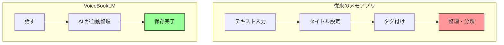
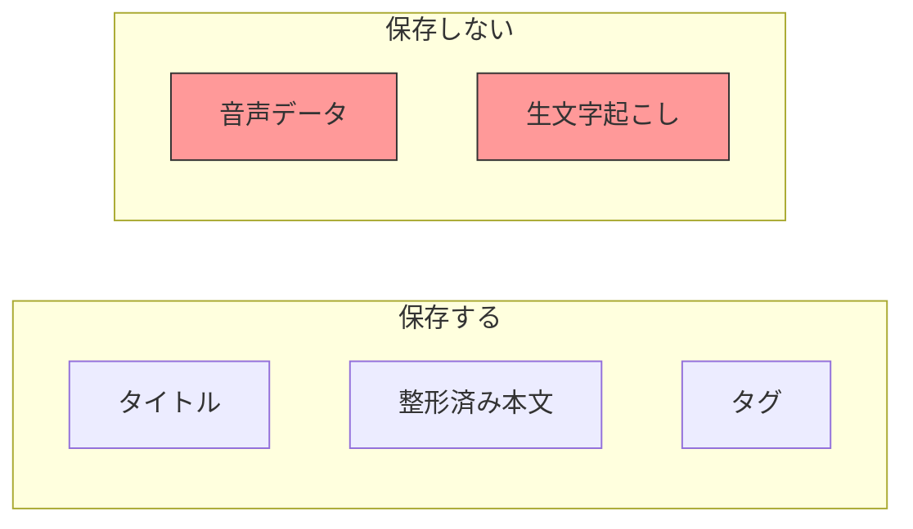

# プロダクト概要

VoiceBookLM は、**音声ファースト × 自動整理** をコンセプトとした AI 搭載ボイスメモアプリケーションです。

## コンセプト

> 「話すだけで、整理されたメモが自動で作られる」

ユーザーは**話すことに集中**するだけ。AI がタイトル・本文・タグを自動生成し、クラウドに保存します。

## 解決する課題

| 課題 | VoiceBookLM の解決策 |
|------|---------------------|
| キーボード入力は思考を阻害 | 音声入力で思考の流れを保つ |
| 整理作業がユーザー負担 | AI が自動でタイトル・タグ生成 |
| 会議向けが多い | **個人の思考ログ**に特化 |

## 主要機能

### MVPに含む機能

1. **ワンタップ録音** - シンプルな操作で録音開始
2. **AI 自動整理** - タイトル・本文・タグを自動生成
3. **マークダウン対応** - 本文はマークダウン形式で記述・編集・表示
4. **クラウド保存** - どこからでもアクセス可能
5. **全文検索** - 過去のメモを素早く発見
6. **Google 認証** - 安全なログイン

### プライバシー重視設計

> ⚠️ **音声データは処理完了後に削除され、永続保存されません**

## 対象ユースケース

| シーン | 説明 |
|--------|------|
| 面接の振り返り | 面接直後に歩きながら感想を話し、後で検索 |
| 自己分析ログ | 散歩中に気持ちを話し、タグで思考を整理 |
| アイデア記録 | 浮かんだ瞬間に話すだけで保存 |

## 目標数値

| 指標 | 目標 |
|------|------|
| 録音→AI整形完了 | **30秒以内** |
| 検索レスポンス | **0.5秒以内** |
| クラウド稼働率 | **99%以上** |
