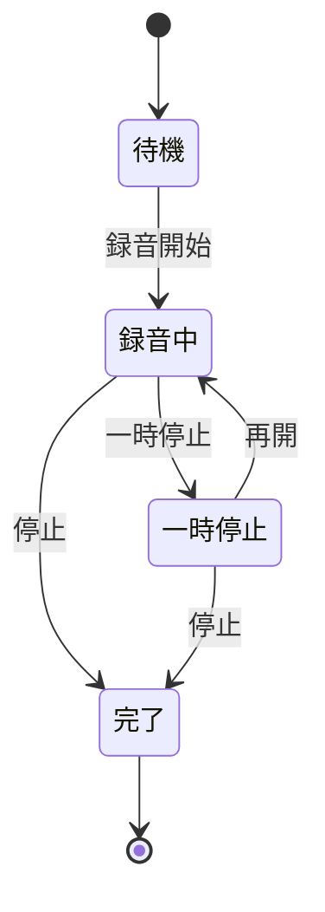
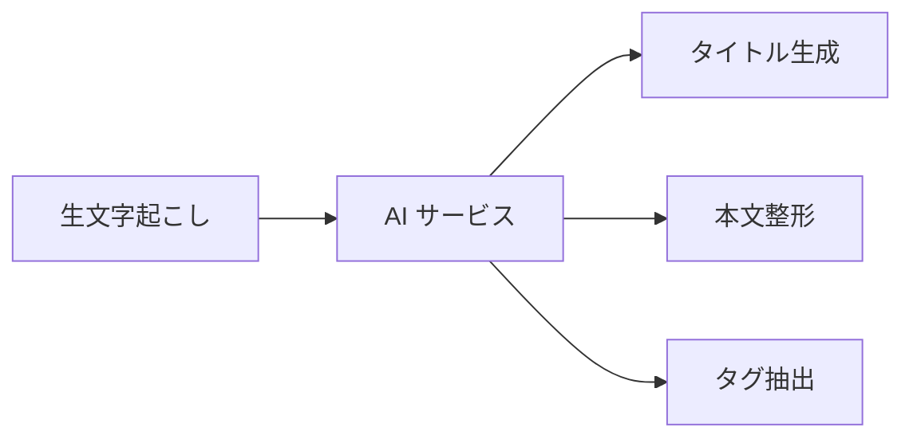
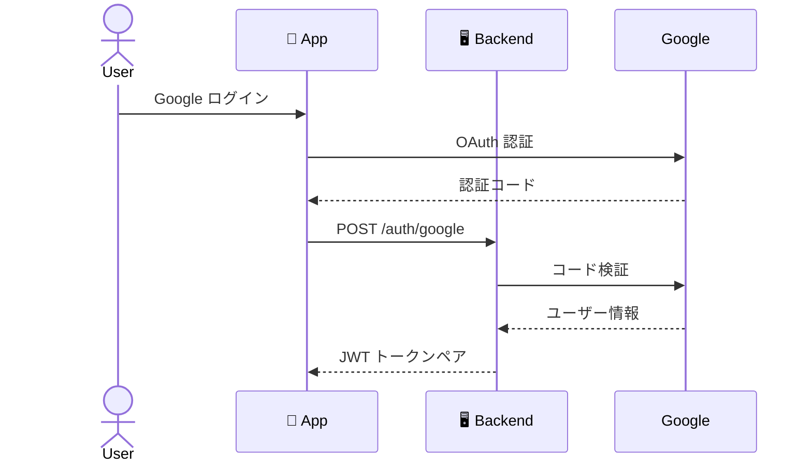

# 要件定義

## 機能要件一覧

### 1. 音声録音

| ID | 要件 |
|----|------|
| 1.1 | ワンタップで録音開始 |
| 1.2 | 録音中を視覚的に表示 |
| 1.3 | 録音時間をリアルタイム表示 |
| 1.4 | 一時停止・再開が可能 |
| 1.5 | 停止後に音声ファイルを確定 |
| 1.6 | 送信完了後に端末から削除 |

---

### 2. 文字起こし

| ID | 要件 |
|----|------|
| 2.1 | 録音完了後に REST API で送信 |
| 2.2 | JWT トークンを Authorization ヘッダーに含める |
| 2.3 | サーバーで音声を ASR に送信 |
| 2.4 | 処理完了後に音声データを削除（永続保存しない） |

---

### 3. AI メモ整形

| ID | 要件 |
|----|------|
| 3.1 | タイトル・本文・タグを自動生成 |
| 3.2 | タグは最大5個 |
| 3.3 | AIエラー時は生文字起こしを本文として使用 |
| 3.4 | 30秒以内に処理完了 |

---

### 4. メモ管理

| 機能 | 説明 |
|------|------|
| **一覧表示** | 日付降順で表示、ページネーション（20件/ページ） |
| **詳細表示** | タイトル・本文・タグ・録音時刻を表示 |
| **検索** | 全文検索 + タグフィルタ、0.5秒以内にレスポンス |
| **編集** | タイトル・本文・タグを編集可能 |
| **削除** | 論理削除（90日後に物理削除） |

---

### 5. 認証

| ID | 要件 |
|----|------|
| 5.1 | Google OAuth 認証 |
| 5.2 | アクセストークン有効期限: **15分** |
| 5.3 | リフレッシュトークン有効期限: **7日** |
| 5.4 | トークンローテーション実装 |

---

## 非機能要件

### パフォーマンス

| 指標 | 目標値 |
|------|--------|
| 録音→AI整形完了 | 30秒以内 |
| メモ検索レスポンス | 0.5秒以内 |
| メモ一覧初回表示 | 2秒以内 |

### セキュリティ

| 項目 | 実装 |
|------|------|
| 通信暗号化 | HTTPS (TLS 1.2+) |
| DB暗号化 | AWS RDS ストレージ暗号化 |
| トークン保存 | SecureStore (iOS Keychain / Android EncryptedSharedPreferences) |
| 認可 | ユーザーは自分のメモのみアクセス可能 |

### 可用性

| 項目 | 目標 |
|------|------|
| クラウド稼働率 | 99%以上 |
| DBリトライ | 最大3回 |
| 外部APIタイムアウト | 60秒 |
