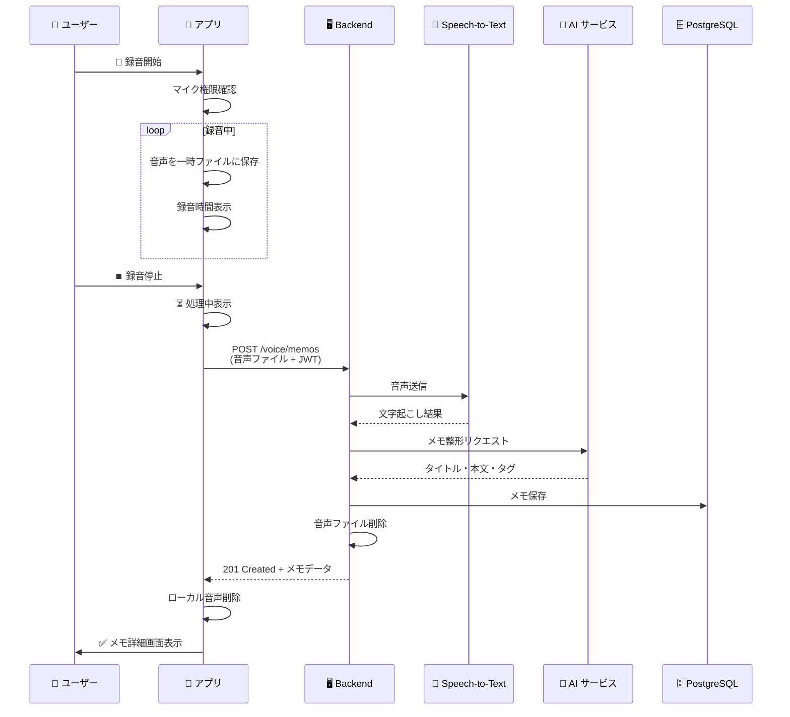
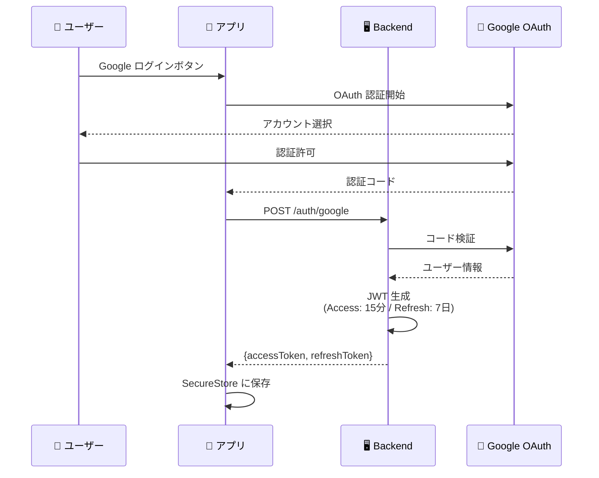
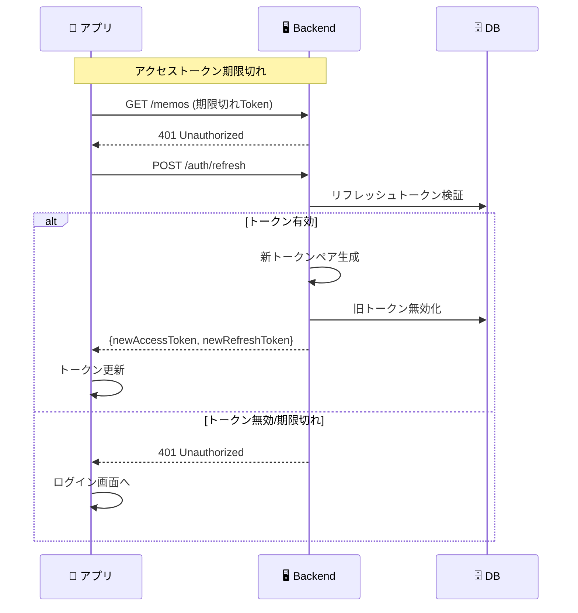
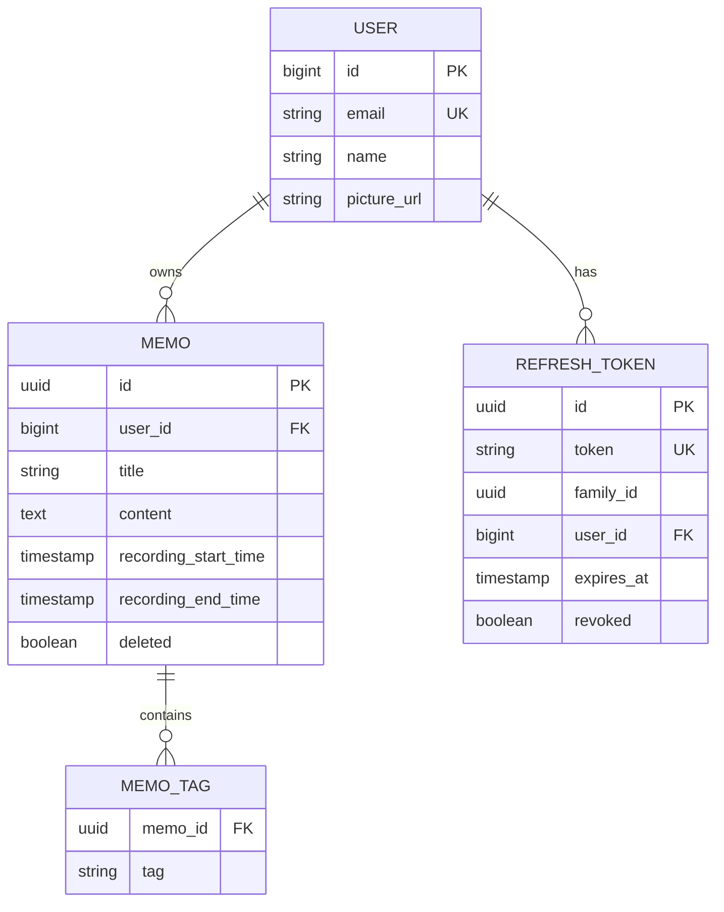
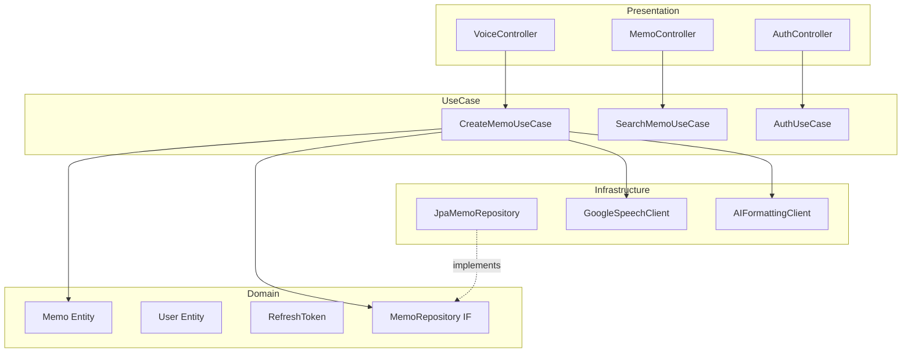

# システムフロー

## メイン処理フロー

録音から保存までの全体フローです。

```mermaid
sequenceDiagram
    participant User as 👤 ユーザー
    participant App as 📱 アプリ
    participant API as 🖥️ Backend
    participant ASR as 🎤 Speech-to-Text
    participant AI as 🤖 AI サービス
    participant DB as 🗄️ PostgreSQL

    User->>App: 🔴 録音開始
    App->>App: マイク権限確認
    
    loop 録音中
        App->>App: 音声を一時ファイルに保存
        App->>App: 録音時間表示
    end
    
    User->>App: ⏹️ 録音停止
    App->>App: ⏳ 処理中表示
    
    App->>API: POST /voice/memos<br/>(音声ファイル + JWT)
    API->>ASR: 音声送信
    ASR-->>API: 文字起こし結果
    
    API->>AI: メモ整形リクエスト
    AI-->>API: タイトル・本文・タグ
    
    API->>DB: メモ保存
    API->>API: 音声ファイル削除
    
    API-->>App: 201 Created + メモデータ
    App->>App: ローカル音声削除
    App->>User: ✅ メモ詳細画面表示
```

---

## 認証フロー

### 初回ログイン

```mermaid
sequenceDiagram
    participant User as 👤 ユーザー
    participant App as 📱 アプリ
    participant Backend as 🖥️ Backend
    participant Google as 🔐 Google OAuth

    User->>App: Google ログインボタン
    App->>Google: OAuth 認証開始
    Google-->>User: アカウント選択
    User->>Google: 認証許可
    Google-->>App: 認証コード
    
    App->>Backend: POST /auth/google
    Backend->>Google: コード検証
    Google-->>Backend: ユーザー情報
    
    Backend->>Backend: JWT 生成<br/>(Access: 15分 / Refresh: 7日)
    Backend-->>App: {accessToken, refreshToken}
    App->>App: SecureStore に保存
```

### トークンローテーション

```mermaid
sequenceDiagram
    participant App as 📱 アプリ
    participant Backend as 🖥️ Backend
    participant DB as 🗄️ DB

    Note over App,Backend: アクセストークン期限切れ
    
    App->>Backend: GET /memos (期限切れToken)
    Backend-->>App: 401 Unauthorized
    
    App->>Backend: POST /auth/refresh
    Backend->>DB: リフレッシュトークン検証
    
    alt トークン有効
        Backend->>Backend: 新トークンペア生成
        Backend->>DB: 旧トークン無効化
        Backend-->>App: {newAccessToken, newRefreshToken}
        App->>App: トークン更新
    else トークン無効/期限切れ
        Backend-->>App: 401 Unauthorized
        App->>App: ログイン画面へ
    end
```

---

## データベース関係

```mermaid
erDiagram
    USER ||--o{ MEMO : "owns"
    USER ||--o{ REFRESH_TOKEN : "has"
    MEMO ||--o{ MEMO_TAG : "contains"

    USER {
        bigint id PK
        string email UK
        string name
        string picture_url
    }

    MEMO {
        uuid id PK
        bigint user_id FK
        string title
        text content
        timestamp recording_start_time
        timestamp recording_end_time
        boolean deleted
    }

    MEMO_TAG {
        uuid memo_id FK
        string tag
    }

    REFRESH_TOKEN {
        uuid id PK
        string token UK
        uuid family_id
        bigint user_id FK
        timestamp expires_at
        boolean revoked
    }
```

---

## コンポーネント連携

```mermaid
graph TB
    subgraph Presentation
        MemoCtrl[MemoController]
        AuthCtrl[AuthController]
        VoiceCtrl[VoiceController]
    end

    subgraph UseCase
        CreateMemo[CreateMemoUseCase]
        SearchMemo[SearchMemoUseCase]
        AuthUC[AuthUseCase]
    end

    subgraph Domain
        Memo[Memo Entity]
        User[User Entity]
        Token[RefreshToken]
        MemoRepo[MemoRepository IF]
    end

    subgraph Infrastructure
        JpaMemoRepo[JpaMemoRepository]
        GoogleClient[GoogleSpeechClient]
        AIClient[AIFormattingClient]
    end

    VoiceCtrl --> CreateMemo
    MemoCtrl --> SearchMemo
    AuthCtrl --> AuthUC
    
    CreateMemo --> Memo
    CreateMemo --> MemoRepo
    CreateMemo --> GoogleClient
    CreateMemo --> AIClient
    
    JpaMemoRepo -.->|implements| MemoRepo
```
