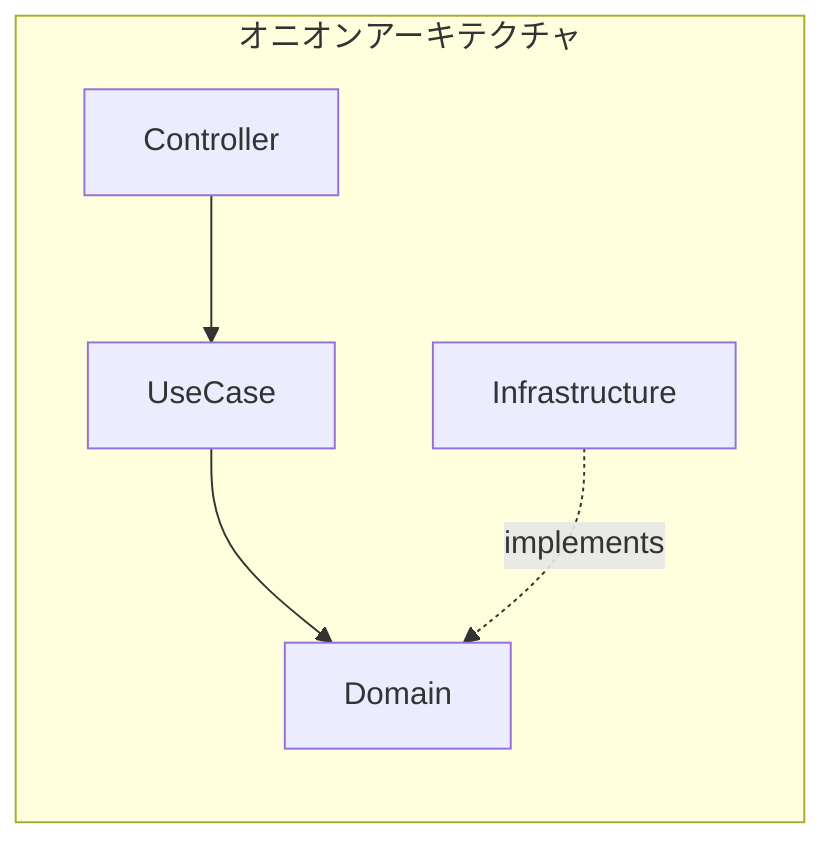
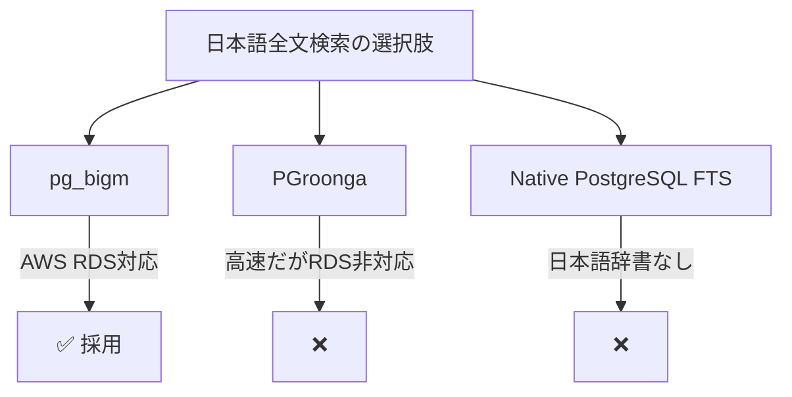
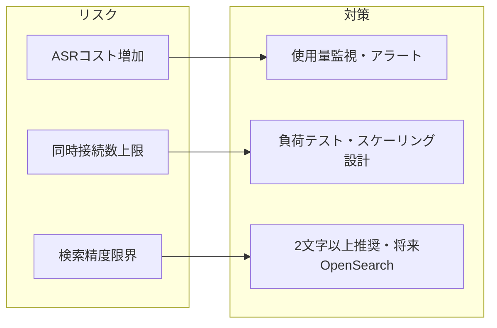

# 技術的意思決定

## アーキテクチャ選定

### オニオンアーキテクチャ × DDD 採用理由

| 観点               | 採用理由                                 |
| ------------------ | ---------------------------------------- |
| **ドメイン独立性** | ビジネスロジックをフレームワークから隔離 |
| **テスタビリティ** | Domain/UseCase は純粋Kotlinでテスト可能  |
| **拡張性**         | DB変更やCQRS導入に強い構造               |

---

## 主な技術選定

### 音声録音: expo-audio vs expo-audio-stream

| 選択肢            | 特徴                             | 判断          |
| ----------------- | -------------------------------- | ------------- |
| **expo-audio**    | Expo公式、安定性高               | ✅ 採用       |
| expo-audio-stream | サードパーティ、リアルタイム対応 | Phase 2で検討 |

> **MVP では安定性を優先**し、expo-audio を採用。リアルタイム機能は Phase 2 で検討。

---

### 日本語全文検索: pg_bigm vs PGroonga

| 選択肢      | AWS RDS   | 性能    | 判断    |
| ----------- | --------- | ------- | ------- |
| **pg_bigm** | ✅ 対応   | 実用的  | ✅ 採用 |
| PGroonga    | ❌ 非対応 | 最高速  | ❌      |
| Native FTS  | ✅ 対応   | 日本語× | ❌      |

---

### JWT署名: HS256 vs RS256

| 選択肢    | 特徴                           | 判断     |
| --------- | ------------------------------ | -------- |
| **HS256** | 対称鍵、シンプル、高速         | ✅ 採用  |
| RS256     | 非対称鍵、マイクロサービス向き | 将来検討 |

> MVP はシングルサーバー構成のため、シンプルな HS256 を採用。

---

## リスクと対策

### 技術的リスク

| リスク                       | 対策                               |
| ---------------------------- | ---------------------------------- |
| Google Cloud ASR コスト増加  | 月間使用量監視、録音時間制限       |
| pg_bigm 検索精度             | 2文字以上推奨、将来OpenSearch移行  |
| リフレッシュトークン実装ミス | Token Family管理、自動リユース検出 |

---

## Phase 2 以降の検討事項

| 機能       | 現状                 | Phase 2                       |
| ---------- | -------------------- | ----------------------------- |
| 音声送信   | REST API 一括送信    | -                             |
| 文字起こし | 録音完了後に一括処理 | -                             |
| JWT署名    | HS256                | RS256（マイクロサービス化時） |
| 検索       | pg_bigm              | OpenSearch（大規模化時）      |
