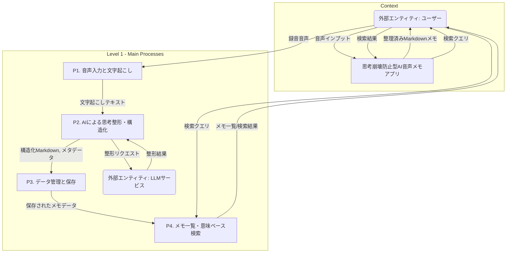

```mermaid
graph TD
    subgraph Context
        User(外部エンティティ: ユーザー)
        System[思考崩壊防止型AI音声メモアプリ]

        User -- 音声インプット --> System
        System -- 整理済みMarkdownメモ --> User
        System -- 検索クエリ --> User
        User -- 検索結果 --> System
    end

    subgraph Level 1 - Main Processes
        A[P1. 音声入力と文字起こし]
        B[P2. AIによる思考整形・構造化]
        C[P3. データ管理と保存]
        D[P4. メモ一覧・意味ベース検索]
        LLM(外部エンティティ: LLMサービス)

        User -- 録音音声 --> A
        A -- 文字起こしテキスト --> B
        B -- 構造化Markdown, メタデータ --> C
        C -- 保存されたメモデータ --> D
        D -- メモ一覧/検索結果 --> User
        User -- 検索クエリ --> D
        B -- 整形リクエスト --> LLM
        LLM -- 整形結果 --> B
    end
```