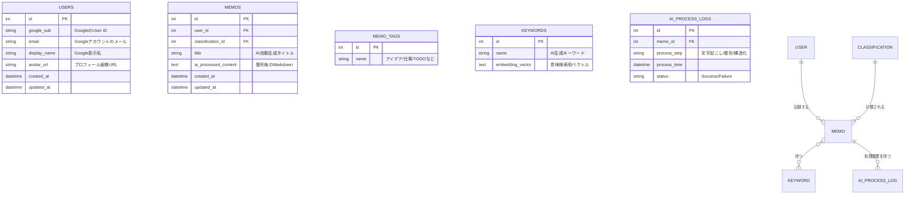

```mermaid
erDiagram
    USERS {
        int id PK
        string google_sub "GoogleのUser ID"
        string email "Googleアカウントのメール"
        string display_name "Google表示名"
        string avatar_url "プロフィール画像URL"
        datetime created_at
        datetime updated_at
    }

    MEMOS {
        int id PK
        int user_id FK
        int classification_id FK
        string title "AI自動生成タイトル"
        text ai_processed_content "整形後のMarkdown"
        datetime created_at
        datetime updated_at
    }

    MEMO_TAGS {
        int id PK
        string name "アイデア/仕事/TODOなど"
    }

    KEYWORDS {
        int id PK
        string name "AI生成キーワード"
        text embedding_vector "意味検索用ベクトル"
    }

    AI_PROCESS_LOGS {
        int id PK
        int memo_id FK
        string process_step "文字起こし/整形/構造化"
        datetime process_time
        string status "Success/Failure"
    }
    
    USER ||--o{ MEMO : "記録する"
    CLASSIFICATION ||--o{ MEMO : "分類される"
    MEMO }o--o{ KEYWORD : "持つ"
    MEMO ||--o{ AI_PROCESS_LOG : "処理履歴を持つ"
```
