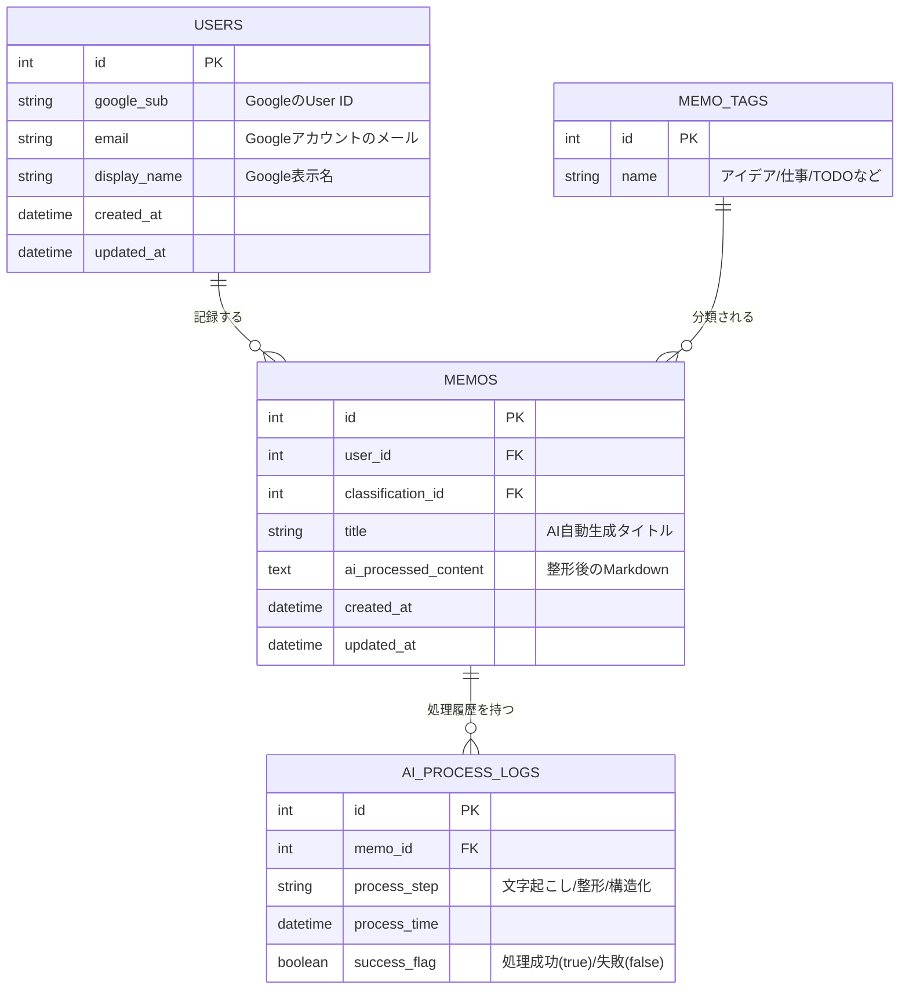

```mermaid
erDiagram
    USERS {
        int id PK
        string google_sub "GoogleのUser ID"
        string email "Googleアカウントのメール"
        string display_name "Google表示名"
        datetime created_at
        datetime updated_at
    }

    MEMOS {
        int id PK
        int user_id FK
        int classification_id FK
        string title "AI自動生成タイトル"
        text ai_processed_content "整形後のMarkdown"
        datetime created_at
        datetime updated_at
    }

    MEMO_TAGS {
        int id PK
        string name "アイデア/仕事/TODOなど"
    }

    AI_PROCESS_LOGS {
        int id PK
        int memo_id FK
        string process_step "文字起こし/整形/構造化"
        datetime process_time
        boolean success_flag "処理成功(true)/失敗(false)"
    }
    
    USERS ||--o{ MEMOS : "記録する"
    MEMO_TAGS ||--o{ MEMOS : "分類される"
    MEMOS ||--o{ AI_PROCESS_LOGS : "処理履歴を持つ"
```
