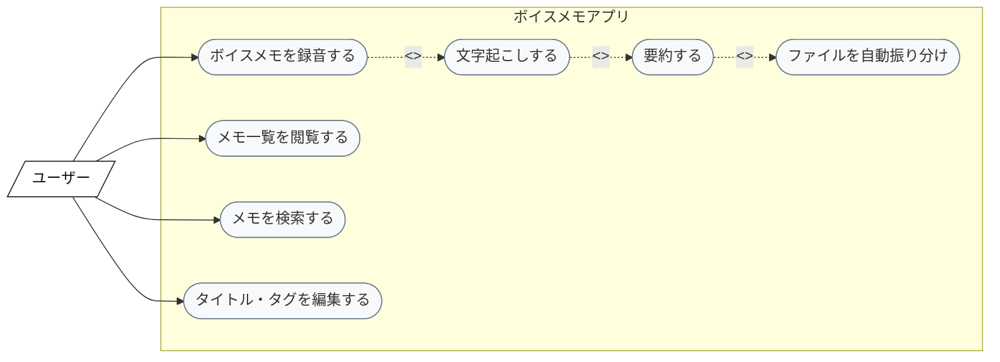

```mermaid
flowchart LR
    classDef actor fill:#ffffff,stroke:#111,stroke-width:1px,color:#111;
    classDef usecase fill:#f7f9fb,stroke:#6a7b8c,stroke-width:1px,rx:16px,ry:16px;

    %% アクター
    User[/ユーザー/]
    class User actor;

    %% システム境界（ボイスメモアプリ）
    subgraph App [ボイスメモアプリ]
        direction TB
        UC_Record([ボイスメモを録音する])
        UC_Transcribe([文字起こしする])
        UC_Summarize([要約する])
        UC_Sort([ファイルを自動振り分け])
        UC_ViewList([メモ一覧を閲覧する])
        UC_Search([メモを検索する])
        UC_Edit([タイトル・タグを編集する])
    end
    class UC_Record,UC_Transcribe,UC_Summarize,UC_Sort,UC_ViewList,UC_Search,UC_Edit usecase;

    %% 関連（実線）
    User --> UC_Record
    User --> UC_ViewList
    User --> UC_Search
    User --> UC_Edit

    %% インクルード関係（破線）
    UC_Record -.->|<<include>>| UC_Transcribe
    UC_Transcribe -.->|<<include>>| UC_Summarize
    UC_Summarize -.->|<<include>>| UC_Sort
```
