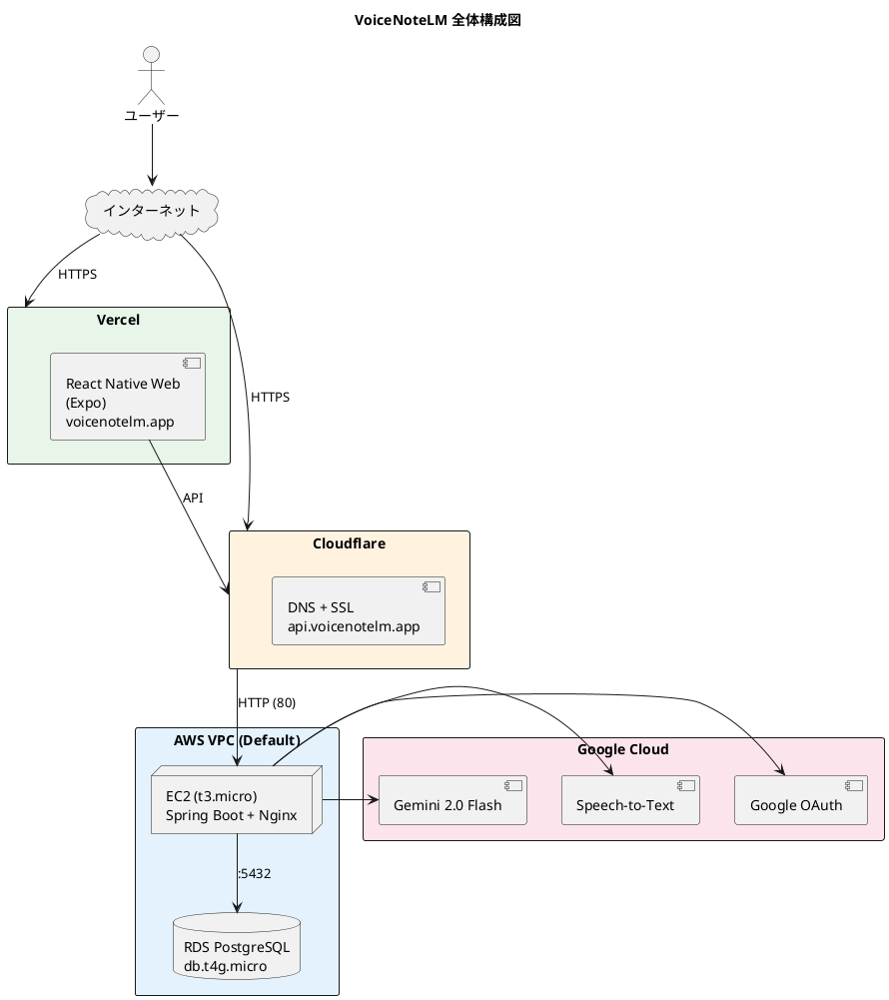
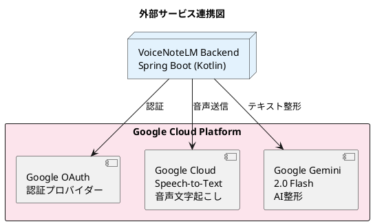
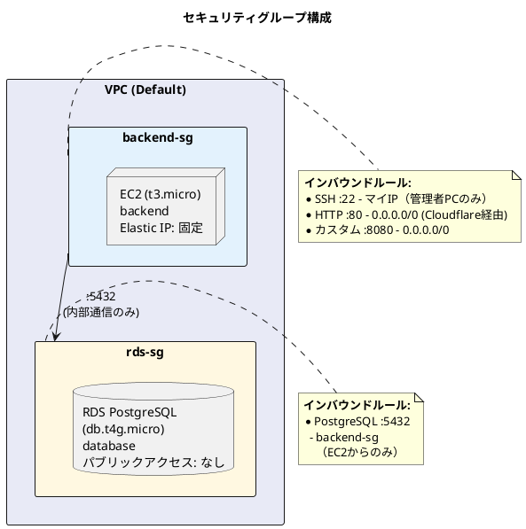
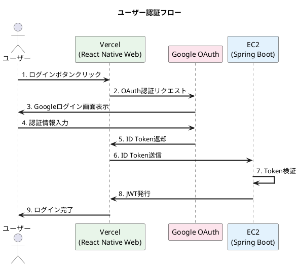
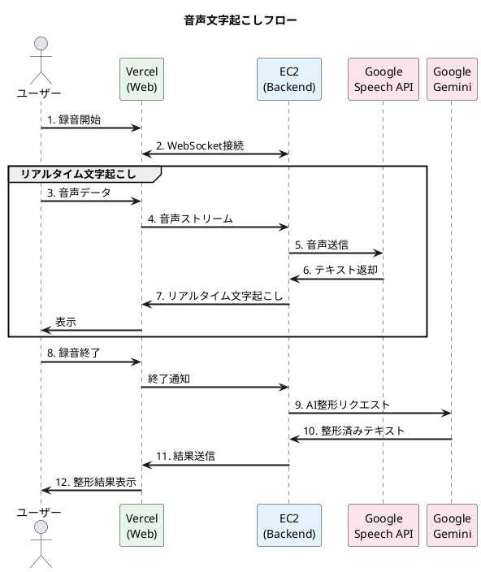

# VoiceNoteLM デプロイシステム構成図

## 全体構成



## 外部サービス連携



## セキュリティグループ構成



## データフロー

### 1. ユーザー認証フロー



### 2. 音声文字起こしフロー



## コンポーネント詳細

### Frontend (Vercel)

| 項目 | 値 |
|-----|---|
| フレームワーク | React Native Web / Expo |
| ホスティング | Vercel |
| ドメイン | voicenotelm.app |
| SSL | Vercel自動SSL |
| ビルド | 自動（Git push時） |

**環境変数:**
| 変数名 | 値 |
|-------|---|
| `EXPO_PUBLIC_GOOGLE_WEB_CLIENT_ID` | Google OAuth Client ID |
| `EXPO_PUBLIC_API_BASE_URL` | `https://api.voicenotelm.app` |
| `EXPO_PUBLIC_WS_BASE_URL` | `wss://api.voicenotelm.app` |

### Backend (AWS EC2)

| 項目 | 値 |
|-----|---|
| インスタンスタイプ | t3.micro |
| AMI | Amazon Linux 2023 |
| Java | Amazon Corretto 21 |
| フレームワーク | Spring Boot (Kotlin) |
| パス | `/opt/voicenotelm/` |
| サービス管理 | systemd (voicenotelm) |

### Database (AWS RDS)

| 項目 | 値 |
|-----|---|
| エンジン | PostgreSQL 16 |
| インスタンスクラス | db.t4g.micro |
| ストレージ | 20 GiB gp2 |
| 自動バックアップ | 無効 |
| パブリックアクセス | なし |
| データベース名 | voicenotelm |

### Nginx設定

```nginx
server {
    listen 80;
    server_name api.voicenotelm.app;

    location / {
        proxy_pass http://localhost:8080;
        proxy_set_header Host $host;
        proxy_set_header X-Real-IP $remote_addr;
        proxy_set_header X-Forwarded-For $proxy_add_x_forwarded_for;
        proxy_set_header X-Forwarded-Proto $scheme;

        # WebSocket対応
        proxy_http_version 1.1;
        proxy_set_header Upgrade $http_upgrade;
        proxy_set_header Connection "upgrade";
        proxy_read_timeout 86400;
    }
}
```

## DNS設定 (Cloudflare)

| レコード | タイプ | 名前 | 値 | Proxy |
|---------|-------|------|-----|-------|
| API | A | api | EC2 Elastic IP | DNS only (灰色) |
| Frontend | CNAME | @ | cname.vercel-dns.com | DNS only (灰色) |
| Frontend | CNAME | www | cname.vercel-dns.com | DNS only (灰色) |

## 想定コスト (月額)

| サービス | 費用 |
|---------|------|
| EC2 t3.micro | 無料枠（750時間/月） |
| RDS db.t4g.micro | 無料枠（750時間/月） |
| Elastic IP | 無料（EC2起動中） |
| Vercel | 無料（Hobby） |
| Cloudflare | 無料 |
| **合計** | **$0〜5** |

## 運用コマンド

### EC2操作

```bash
# SSH接続
ssh -i <your-key.pem> ec2-user@<Elastic IP>

# アプリケーション再起動
sudo systemctl restart voicenotelm

# ステータス確認
sudo systemctl status voicenotelm

# ログ確認
sudo journalctl -u voicenotelm -n 50 --no-pager

# メモリ確認
free -h
```

### RDS接続

```bash
# EC2経由でRDSに接続
psql -h <RDSエンドポイント> -U <username> -d <database>
```

### デプロイ手順

```bash
# ローカルでビルド
cd voicebooklm-backend
./gradlew bootJar

# EC2に転送
scp -i <your-key.pem> build/libs/*.jar ec2-user@<IP>:/path/to/app.jar

# EC2で再起動
sudo systemctl restart voicenotelm
```
