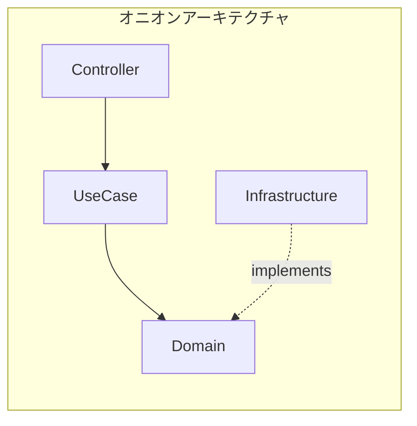

# 技術的意思決定

## アーキテクチャ選定

### オニオンアーキテクチャ × DDD 採用理由

| 観点               | 採用理由                                 |
| ------------------ | ---------------------------------------- |
| **ドメイン独立性** | ビジネスロジックをフレームワークから隔離 |
| **テスタビリティ** | Domain/UseCase は純粋Kotlinでテスト可能  |
| **拡張性**         | DB変更やCQRS導入に強い構造               |

---
