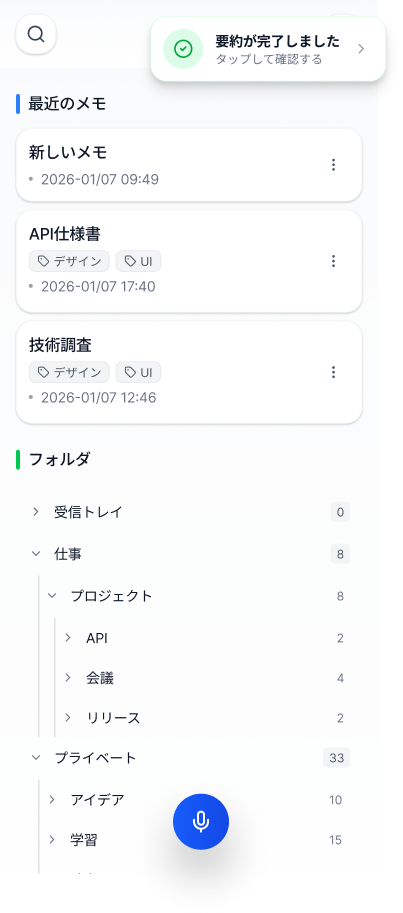
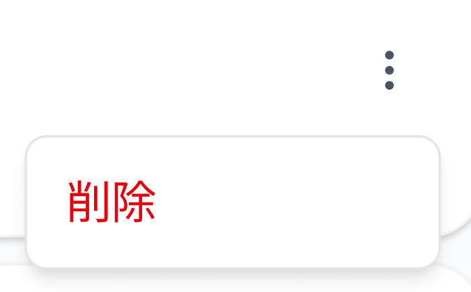

# ホーム画面

## 基本情報

| 項目     | 内容                       |
| -------- | -------------------------- |
| 画面ID   | SCR-002                    |
| 画面名   | ホーム画面                 |
| URL/パス | /home                      |
| 認証要否 | 要（ログイン済みユーザー） |

## 画面概要

ログイン済みユーザーのメイン画面。最近作成・編集したメモの一覧と、フォルダによるメモの整理機能を提供する。また、音声入力ボタンから新規メモの作成が可能。

## 画面イメージ

### 通常状態

### AI整形実行中

### AI整形完了

### AI整形に失敗

## 画面要素一覧

### ヘッダー部

| 要素ID      | 要素名     | 種別     | 必須 | 説明                           |
| ----------- | ---------- | -------- | ---- | ------------------------------ |
| btn_search  | 検索ボタン | アイコン | -    | メモ検索画面へ遷移             |
| btn_setting | 設定ボタン | アイコン | -    | 設定画面へ遷移（歯車アイコン） |

### 最近のメモセクション

| 要素ID         | 要素名             | 種別       | 必須 | 説明                                     |
| -------------- | ------------------ | ---------- | ---- | ---------------------------------------- |
| section_recent | 最近のメモ         | セクション | -    | セクションヘッダー                       |
| memo_card      | メモカード         | カード     | -    | メモのプレビューカード（複数）           |
| memo_title     | メモタイトル       | ラベル     | -    | メモのタイトル表示                       |
| memo_tags      | タグ               | バッジ     | -    | メモに付与されたタグ（デザイン、UIなど） |
| memo_date      | 更新日時           | ラベル     | -    | 最終更新日時（YYYY-MM-DD HH:mm）         |
| btn_memo_menu  | メモメニューボタン | アイコン   | -    | メモの編集・削除メニュー（︙）           |

### フォルダセクション

| 要素ID         | 要素名       | 種別           | 必須 | 説明                               |
| -------------- | ------------ | -------------- | ---- | ---------------------------------- |
| section_folder | フォルダ     | セクション     | -    | セクションヘッダー                 |
| folder_item    | フォルダ項目 | リストアイテム | -    | フォルダ名と件数を表示             |
| folder_name    | フォルダ名   | ラベル         | -    | フォルダ名（受信トレイ、仕事など） |
| folder_count   | メモ件数     | ラベル         | -    | フォルダ内のメモ件数               |
| folder_expand  | 展開アイコン | アイコン       | -    | サブフォルダの展開/折りたたみ（>） |

### 音声入力ボタン

| 要素ID    | 要素名         | 種別 | 必須 | 説明                       |
| --------- | -------------- | ---- | ---- | -------------------------- |
| btn_voice | 音声入力ボタン | FAB  | -    | 音声入力で新規メモ作成開始 |

### 通知トースト（グローバルコンポーネント）

> AI処理通知トーストの詳細仕様は [CMN-001 AI処理通知トースト](./CMN-001_AI処理通知トースト.md) を参照してください。

### メモメニュー（ポップアップ）

メモカードの︙ボタンをタップすると表示されるコンテキストメニュー。

| 要素ID      | 要素名 | 種別   | 必須 | 説明                                 |
| ----------- | ------ | ------ | ---- | ------------------------------------ |
| menu_delete | 削除   | ボタン | -    | メモ削除確認ダイアログを表示（赤字） |

## 画面遷移

### 遷移元

| 遷移元         | 条件/アクション |
| -------------- | --------------- |
| ウェルカム画面 | ログイン成功後  |
| 各画面         | 戻るボタン押下  |

## API連携

| メソッド | エンドポイント                                | 用途                                  |
| -------- | --------------------------------------------- | ------------------------------------- |
| GET      | /api/memos?sort=updated_at&order=desc&limit=3 | メモ一覧取得（更新日時降順、最新3件） |
| GET      | /api/folders                                  | フォルダ階層取得（memoCount含む）     |
| GET      | /api/memos?folder_id=:id                      | フォルダ内メモ取得（フォルダ展開時）  |
| GET      | /api/memos/:id/status                         | メモのAI処理状態確認（将来実装予定）  |

## バリデーション

なし

## 状態

| 状態         | 説明                                                        | 画像                                |
| ------------ | ----------------------------------------------------------- | ----------------------------------- |
| 通常状態     | メモ一覧とフォルダ一覧を表示                                | SCR-002\_ホーム画面.png             |
| AI整形実行中 | [通知トースト](./CMN-001_AI処理通知トースト.md)表示         | SCR-002\_ホーム画面AI整形実行中.png |
| AI整形完了   | [通知トースト](./CMN-001_AI処理通知トースト.md)で確認を案内 | SCR-002\_ホーム画面AI整形完了.png   |
| AI整形に失敗 | [通知トースト](./CMN-001_AI処理通知トースト.md)でエラー表示 | SCR-002\_ホーム画面AI整形に失敗.png |

## 備考

- ログイン済みユーザー専用画面
- 未認証ユーザーはウェルカム画面へリダイレクト
- 最近のメモは更新日時の降順で表示
- フォルダは階層構造をサポート（サブフォルダあり）
- AI整形処理はバックグラウンドで実行され、完了時にトースト通知
