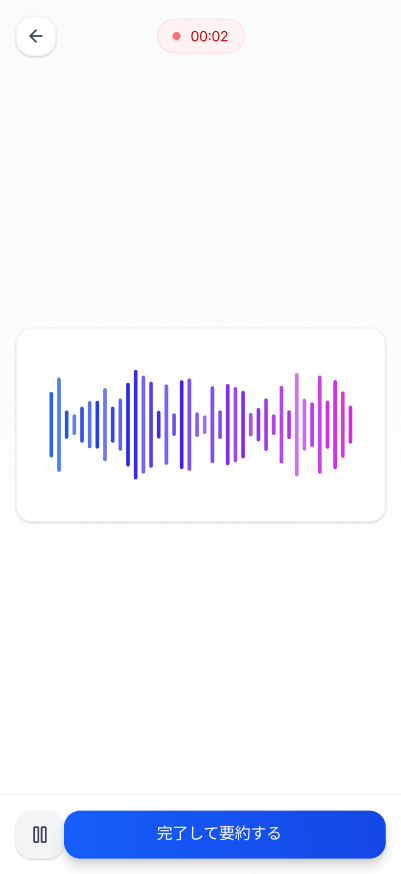

# 録音画面

## 基本情報

| 項目     | 内容                       |
| -------- | -------------------------- |
| 画面ID   | SCR-003                    |
| 画面名   | 録音画面                   |
| URL/パス | /recording                 |
| 認証要否 | 要（ログイン済みユーザー） |

## 画面概要

音声メモを録音するための画面。リアルタイムで音声波形を表示し、録音の一時停止・再開が可能。録音完了後はAIによる整形処理へ遷移する。

## 画面イメージ

### 録音中

### 一時停止中

## 画面要素一覧

### ヘッダー部

| 要素ID              | 要素名             | 種別     | 必須 | 説明                               |
| ------------------- | ------------------ | -------- | ---- | ---------------------------------- |
| btn_back            | 戻るボタン         | アイコン | -    | 前画面へ戻る（録音破棄確認あり）   |
| recording_indicator | 録音インジケーター | バッジ   | -    | 赤い●と経過時間を表示（MM:SS形式） |

### 波形表示エリア

| 要素ID        | 要素名         | 種別         | 必須 | 説明                                                                    |
| ------------- | -------------- | ------------ | ---- | ----------------------------------------------------------------------- |
| waveform_area | 波形表示エリア | コンテナ     | -    | 音声波形を表示するエリア                                                |
| waveform      | 音声波形       | グラフィック | -    | リアルタイムで音声入力レベルを波形で可視化（青→ピンクのグラデーション） |

### 操作ボタン

| 要素ID       | 要素名         | 種別     | 必須 | 説明                                         |
| ------------ | -------------- | -------- | ---- | -------------------------------------------- |
| btn_pause    | 一時停止ボタン | アイコン | -    | 録音を一時停止（⏸アイコン）                  |
| btn_resume   | 再開ボタン     | アイコン | -    | 一時停止中に表示、録音を再開（▷アイコン）    |
| btn_complete | 完了ボタン     | ボタン   | -    | 「完了してAI整形する」録音を終了しAI処理開始 |

## 画面遷移

### 遷移元

| 遷移元     | 条件/アクション           |
| ---------- | ------------------------- |
| ホーム画面 | 音声入力ボタン（FAB）押下 |

### 遷移先

| 遷移先     | 条件/アクション                                                                               |
| ---------- | --------------------------------------------------------------------------------------------- |
| ホーム画面 | 完了してAI整形するボタン押下（[通知トースト](./CMN-001_AI処理通知トースト.md)を表示して遷移） |

## API連携

| メソッド | エンドポイント   | 用途                                               |
| -------- | ---------------- | -------------------------------------------------- |
| POST     | /api/voice/memos | 音声アップロード・文字起こし・AI整形を一括処理する |

## バリデーション

| 項目       | ルール                       | エラーメッセージ例                   |
| ---------- | ---------------------------- | ------------------------------------ |
| 録音時間   | 最低1秒以上の録音が必要      | 録音時間が短すぎます                 |
| 録音時間   | 最大60分まで                 | 録音時間の上限に達しました           |
| マイク権限 | マイクへのアクセス許可が必要 | マイクへのアクセスを許可してください |

## 状態

| 状態       | 説明                                         | 画像                          |
| ---------- | -------------------------------------------- | ----------------------------- |
| 録音中     | 波形がアニメーションし、経過時間が更新される | SCR-003\_録音画面.png         |
| 一時停止中 | 波形が静止し、再開ボタンが表示される         | SCR-003\_録音画面一時停止.png |

## 備考

- ログイン済みユーザー専用画面
- 録音中は画面スリープを無効化
- バックグラウンド移行時は録音を自動的に一時停止
- 録音データはローカルに一時保存され、完了時にサーバーへアップロード
- 戻るボタン押下時は録音破棄確認ダイアログを表示
- 録音インジケーターの●は録音中に点滅アニメーション
