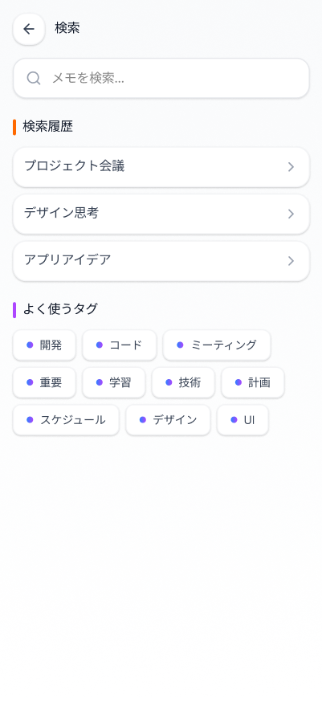

# メモ検索画面

## 基本情報

| 項目     | 内容                       |
| -------- | -------------------------- |
| 画面ID   | SCR-004                    |
| 画面名   | メモ検索画面               |
| URL/パス | /search                    |
| 認証要否 | 要（ログイン済みユーザー） |

## 画面概要

キーワードによるメモの全文検索機能を提供する画面。検索履歴とよく使うタグからの絞り込みにも対応し、目的のメモに素早くアクセスできる。

## 画面イメージ

### 初期状態（検索前）

### 検索結果あり

### 検索結果なし

## 画面要素一覧

### ヘッダー部

| 要素ID     | 要素名       | 種別     | 必須 | 説明                       |
| ---------- | ------------ | -------- | ---- | -------------------------- |
| btn_back   | 戻るボタン   | アイコン | -    | 前画面（ホーム画面）へ戻る |
| page_title | 画面タイトル | ラベル   | -    | 「検索」を表示             |

### 検索入力部

| 要素ID       | 要素名       | 種別     | 必須 | 説明                              |
| ------------ | ------------ | -------- | ---- | --------------------------------- |
| input_search | 検索入力欄   | テキスト | -    | プレースホルダー「メモを検索...」 |
| btn_clear    | クリアボタン | アイコン | -    | 検索文字列をクリア（×アイコン）   |

### 検索履歴セクション（初期状態のみ表示）

| 要素ID          | 要素名       | 種別           | 必須 | 説明                                   |
| --------------- | ------------ | -------------- | ---- | -------------------------------------- |
| section_history | 検索履歴     | セクション     | -    | セクションヘッダー「検索履歴」         |
| history_item    | 履歴項目     | リストアイテム | -    | 過去の検索キーワード（タップで再検索） |
| history_expand  | 展開アイコン | アイコン       | -    | 履歴詳細へ遷移（>アイコン）            |

### よく使うタグセクション（初期状態のみ表示）

| 要素ID       | 要素名       | 種別       | 必須 | 説明                                       |
| ------------ | ------------ | ---------- | ---- | ------------------------------------------ |
| section_tags | よく使うタグ | セクション | -    | セクションヘッダー「よく使うタグ」         |
| tag_chip     | タグチップ   | チップ     | -    | タグバッジ（開発、コード、ミーティング等） |

### 検索結果セクション（検索実行後に表示）

| 要素ID          | 要素名         | 種別           | 必須 | 説明                                 |
| --------------- | -------------- | -------------- | ---- | ------------------------------------ |
| section_results | 検索結果       | セクション     | -    | 「検索結果 (N件)」を表示             |
| result_item     | 検索結果項目   | リストアイテム | -    | ヒットしたメモの一覧                 |
| result_title    | メモタイトル   | ラベル         | -    | メモのタイトル表示                   |
| result_tags     | タグ           | バッジ         | -    | メモに付与されたタグ                 |
| result_date     | 更新日時       | ラベル         | -    | 最終更新日時（YYYY-MM-DD HH:mm形式） |
| btn_result_menu | メニューボタン | アイコン       | -    | メモの編集・削除メニュー（︙）       |

### 検索結果なし表示

| 要素ID      | 要素名             | 種別       | 必須 | 説明                                   |
| ----------- | ------------------ | ---------- | ---- | -------------------------------------- |
| empty_state | 結果なしメッセージ | メッセージ | -    | 「該当するメモが見つかりませんでした」 |

## 画面遷移

### 遷移元

| 遷移元     | 条件/アクション |
| ---------- | --------------- |
| ホーム画面 | 検索ボタン押下  |

### 遷移先

| 遷移先       | 条件/アクション          |
| ------------ | ------------------------ |
| ホーム画面   | 戻るボタン押下           |
| メモ詳細画面 | 検索結果のメモ項目タップ |

## API連携

| メソッド | エンドポイント                | 用途                           |
| -------- | ----------------------------- | ------------------------------ |
| GET      | /api/memos/search?q=:keyword  | キーワードによるメモ全文検索   |
| GET      | /api/search/history           | 検索履歴取得                   |
| GET      | /api/tags?sort=usage&limit=10 | よく使うタグ取得（使用頻度順） |

## バリデーション

| 項目       | ルール                  | エラーメッセージ例               |
| ---------- | ----------------------- | -------------------------------- |
| 検索文字列 | 最低1文字以上入力が必要 | 検索キーワードを入力してください |
| 検索文字列 | 最大100文字まで         | 検索キーワードが長すぎます       |

## 状態

| 状態         | 説明                                         | 画像                                      |
| ------------ | -------------------------------------------- | ----------------------------------------- |
| 初期状態     | 検索履歴とよく使うタグを表示                 | SCR-004\_メモ検索画面.png                 |
| 検索結果あり | 検索結果一覧を表示（件数付き）               | SCR-004\_メモ検索画面\_検索ヒットあり.png |
| 検索結果なし | 「該当するメモが見つかりませんでした」を表示 | SCR-004\_検索画面\_検索ヒットなし.png     |

## 備考

- ログイン済みユーザー専用画面
- 検索はメモのタイトル・本文・タグを対象とした全文検索
- 検索は入力完了後に自動実行（デバウンス処理あり）
- 検索履歴は最新10件まで保持
- タグチップタップ時は該当タグでフィルタリング検索を実行
- 検索結果はスクロールによる無限ロード対応
